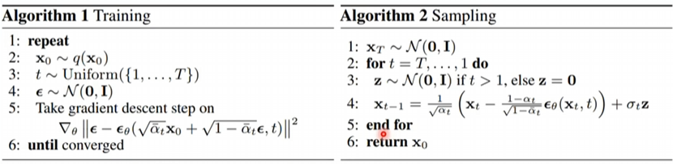

https://speech.ee.ntu.edu.tw/~hylee/ml/2022-spring.php

## 2/18

### Video 2
Piecewise Linear

$y = c * Sigmoid(b+wx_1)$, w, b, c,

$\theta$: A vector of all unknown variable\
Gradient $ g =\nabla L(\theta^{0}) $\
$\eta$: learning rate\
Batch, update, Epoch

Activation function:\
Sigmoid function  
Rectified Linear Unit (ReLU) max(0, )

### Pytorch 1/2 
Mainly introduce some practical advice for coding. 

### Background propagation
Back Propagation: an efficient way to calculate Gradient Descent:\
forward pass, backward pass

没太懂

### Predicting Pokémon CP
Regression: difference in origin $x_{cp}$, and species\
Gradient descent\
Overfitting Regularization

### Pokemon classification
#### Maximum Likelihood
2-D Gaussian distribution:\
$f_{\mu^1,\Sigma^1}(x) = \frac{1}{(2\pi)^{D/2}|\Sigma^1|^{1/2}} \exp\left(-\frac{1}{2}(x - \mu^1)^T(\Sigma^1)^{-1}(x - \mu^1)\right)$

$\mu$ mean $\sum$ covariance\
$\mu^1 = \begin{bmatrix}
75.0 \\
71.3 \\
\end{bmatrix}
\quad
\Sigma^1 = \begin{bmatrix}
874 & 327 \\
327 & 929 \\
\end{bmatrix}$

$P(C_1|x) = \frac{P(x|C_1)P(C_1)}{P(x|C_1)P(C_1) + P(x|C_2)P(C_2)}$

Simplify the function, substitute Gaussian into probability\
$P(C_1|x)=\sigma(z) = \sigma(wx+b)$\
$w=(\mu^1-\mu^2)^T\sum^{-1}, b=...(scalar)$\
So the Boundary for shared $\sum$ is linear.

### Logistic Regression 
（数学推导比较多）
#### Loss function
Cross Entropy for a Bernoulli distribution  
$H(p,q)=−[p\log(q)+(1−p)\log(1−q)]$\
which is better than Square Error. 

Discriminative: Logistic Regression: Directly find $w$ and $b$, which generally have better performance  
Generative: Gaussian description: Have assumptions (Naive Bayes, or ...) of model and find $\mu^1$, $\mu^2$, $\sum$ 

#### Multiclass Classification
跳过了，想做hw再听，觉得现在对$f_{w, b}(x)$的理解还不深

## 2/25

### Video 1
Loss on training data large: Model Bias (need a more complex model) or Optimization\
Loss on testing data large: Overfitting or mismatch -> more data 

### Video 2
How to Optimize:\
$
L(\theta) \approx L(\theta') + (\theta - \theta')^T \vec{g} + \frac{1}{2} (\theta - \theta')^T H (\theta - \theta')
$  
Gradient $\vec{g}$:  
$\vec{g} = \nabla L(\theta')$  
$g_i = \frac{\partial L(\theta')}{\partial \theta_i}$  
$\vec{g} =
\begin{bmatrix}
\frac{\partial L}{\partial \theta_1} \\
\frac{\partial L}{\partial \theta_2} \\
\vdots \\
\frac{\partial L}{\partial \theta_n}
\end{bmatrix}$  
Hessian $H$ is a matrix $H_{ij} = \frac{\partial^2 L(\theta')}{\partial \theta_i \partial \theta_j}$  
For all $v$:
1. $v^T Hv > 0$: $H$ is positive definite, $L(\theta) > L(\theta')$: Local minima
2. $v^T Hv < 0$: $H$ is negative definite, $L(\theta) < L(\theta')$: Local maxima
3. Some eigenvalues are $+$, some are $-$: Saddle point  
Empirical learning: 

### Video 3
Batch: large batch $N$ not necessarily need longer time for gradient computing (parallel computing)

### Video 4
Adaptive $\eta$ (learning rate):\
Error surface  
Critical points (local minima, saddle point):
1. Adagrad 
2. RMSProp
3. Adam: RMSProp + Momentum

Learning Rate Scheduling:  
Learning rate Decay  
Warm up (Residual Network, Transformer Classification)

### Video 5
Regression:  
Right answer: $\hat{y} \leftrightarrow y$  
Classification: class: one-hot vector: $\hat{y} \leftrightarrow y' = \text{softmax}(y)$  
Soft-max (Normalize): $n \geq 3$: $y_i' = \frac{\exp(y_i)}{\sum_j \exp(y_j)}$  
$n=2$ $y' = \text{sigmoid}(y)$

Distance $e$:  
Mean Square Error (MSE): $e = \sum (\hat{y_i} - y_i')^2$  
Cross-entropy: $e = -\sum \hat{y_i} \ln y_i'$  
Minimize Cross-entropy $\leftrightarrow$ Maximize likelihood

### Basic Theory
We want $L(h_{\text{train}}, D_{\text{all}}) - L(h_{\text{all}}, D_{\text{all}}) \leq \delta$\
$\forall h \in \mathcal{H}, |L(h, D_{\text{train}}) - L(h, D_{\text{all}})| \leq \frac{\delta}{2}$

### Gradient Descent 

### Beyond Adam 1

### Beyond Adam 2

## 3/04 CNN

### Video
Image as input

#### V1
Tensor: a Matrix >= 3 dimensional  
1. Observation 1:  
Receptive Field: Kernel Size (3x3), Stride (1 or 2, padding 0, hope receptive field are intersecting)  
2. Observation 2  
Shared parameters: filter  
1 + 2 -> Convolution Layer -> CNN (designed for image)

#### V2
Each filter detects a small pattern (3 * 3 * channel_num, which is a tensor)  
Feature Map  
3. Observation 3  
Max Pooling: Operator  
Convolutional Layer + Pooling  

### Spatial Transformer Layer
CNN is not invariant to scaling and rotation 
Interpolation.

## 3/11 Self-attention

### Video 1
Sequence Labeling  
Self-Attention: dot product additive 

### Video 2
Self-attention  
Multihead self-attention  
Truncated self-attention  
CNN is a simplified self-attention (limited to receptive field)  
RNN, GNN (Graph Neural Network)

### GNN 1
Convolution (spatial-based/Spectral-based)

#### Spatial-based
Terminology:  
Aggregate: use neighbor features to update the next hidden state  
Readout: use all nodes' features to represent the whole graph  
NN4G  
DCNN  
GAT (Graph Attention Network)  
Graph Isomorphism Network

### GNN 2
Deep Graph Library

#### Graph Signal Processing 
Graph Laplacian:  
Degree Matrix $D$, Adjacency Matrix: $A$, $L$ is an operation on graph  
$L = D - A = U \Lambda U^T$  
Discrete time Fourier basis $\lambda$ wave length  
$(Lf)(v_i) = \sum_{v_j \in V} w_{i,j}(f(v_i) - f(v_j))$  
$\begin{aligned}
f^T L f &= \sum_{v_i \in V} f(v_i) \sum_{v_j \in V} w_{i,j}(f(v_i) - f(v_j))\\
&= \frac{1}{2} \sum_{v_i \in V} \sum_{v_j \in V} w_{i,j}(f(v_i) - f(v_j))^2
\end{aligned}
$

Graph Fourier Transform of signal $\hat{x}$: $\hat{x} = U ^T x, \hat{x}_i = u_i \cdot x$  
Inverse Graph Fourier Transform of signal $\hat{x}$: $x = U ^T \hat{x}$

Filtering: Convolution in time domain is multiplication in frequency domain

ChebNet  
听不懂在干什么

#### Spectral-based

## 3/18

### Video 1 Batch Normalization
Batch Normalization  
Internal Covariate Shift

### Video 2 Seq2seq
Transformer  
Seq2seq:  
Chatbox,  
NLP

## Video 3 Decoder
Autoregressive  
Masked Self-attention

## NAT Non autoregressive translation
像一个NAT发展的论文综述  
Naive approach,  
autoregressive,  
GAN, 

Improvement
1. Fertility
2. Sequence-level knowledge distillation
3. Noisy Parallel Decoding NPD

Vanilla NAT, Iterative Refinement, Insertion-based, Insertion+Deletion, CTC-based, Masked-predict, Kermit, CTC, LAS, Imputer (CTC+Mask-Predict)

## Pointer Network

## 3/25

### Video 1 GAN
Discriminator

### Video 2 GAN
JS Divergence\
$G^*= \arg \min(G) \max(D) \mathcal{V}(G, D)$

$JS(P \parallel Q) = \frac{1}{2} KL(P \parallel M) + \frac{1}{2} KL(Q \parallel M)$\
$KL(P \parallel Q) = \sum_{x} P(x) \log\left(\frac{P(x)}{Q(x)}\right)$

WGAN\ 
Wasserstein distance: improve JS divergence: $JS(P_G, P_{\text{data}}) \rightarrow W(P_G, P_{\text{data}})$\
$\max_{D \in 1-\text{Lipschitz}} \left\{ \mathbb{E}_{x \sim P_{\text{data}}} [D(x)] - \mathbb{E}_{x \sim P_{G}} [D(x)] \right\}$\
the $D(x)$ should be smooth enough

### Video 3 BERT anecdote
CBOW (2 transforms): word embedding\
contextualized word embedding\
Multi BERT: Zero-shot Reading Comprehension, alignment

### Video 4 Cycle GAN
Cycle/Dual/Disco GAN: $G_{x\rightarrow y}$, $G_{y\rightarrow x}$

### The theory of GAN (1)
$\max_{D} \mathcal{V}(G, D)$ maximize the discriminator D in GAN  

$\mathcal{V}(G, D) = \mathbb{E}_{x \sim P_{\text{data}}} [\log D(x)] + \mathbb{E}_{x \sim P_{G}} [\log(1 - D(x))]$  
$\mathcal{V}(G, D) = \int_{x} P_{\text{data}}(x)\log D(x) \, dx + \int_{x} P_{G}(x)\log(1 - D(x)) \, dx$

$\mathcal{V}(G, D) = P_{\text{data}}(x)\log D(x) + P_{G}(x)\log(1 - D(x))$ 

$D^*(x) = \frac{P_{\text{data}}(x)}{P_{\text{data}}(x) + P_{G}(x)}$

## 4/01

### Video 1 
Self-supervised Learning

### Video 2 BERT intro
Masking Input: Mask  
Next Sentence Prediction: [CLS] sentence 1. [SEP] sentence 2.\
Pre-trained Fine-tune for Downstream Tasks:\
GLUE: General Language Understanding Evaluation\
in seq, out class: sentiment analysis\
in seq ((n)), out seq (n): POG tagging\
in 2 seqs, out class: NLI Natural language inference\
in seqs, out seqs: QA Extract-based Question Answer

MASS\ BART T5, C4 (open sourced resource)

### Video 3 BERT anecdote
Same with above

### Video 4 GPT outlook
Linear Transform -> Softmax -> distribution  
Few-shot learning, one-shot, zero-shot learning  
SimCLR, BYOL,  
Speech GLUE - SUPERB

## 4/15
????

## 4/22
Auto encoder

### Video 1 basic idea
same idea with Cycle GAN, embedding, representation, code  
Dimension reduction: not deep learning based PCA, t-SNE  
De-noising Auto-encoder

Video 2-8 are all anomaly detection

### Video 2  
Feature disentanglement: know the content of embedding: Voice Conversion  
Discrete Representation: VQVAE

### Video 3
Anomaly detection: other methods outlier, novelty, exception  
one class classifier: Approach: Auto-encoder

### Video 4
A confidence score $c$, a threshold $\lambda$, smaller than, anomaly.

### Video 5
Generating anomaly data

### Video 6 
Without Labels  
https://github.com/ahaque/twitch-troll-detection 

### Video 7
Gaussian Distribution  
Assume the data points are samples from a probability density function $f_{\theta}(x)$\
$\theta$ determine the shape of $f_{\theta}(x)$\
$L(\theta)=f_{\theta}(x^1)f_{\theta}(x^2)...f_{\theta}(x^N)$\
$\theta^* = \arg \max_\theta L(\theta), \theta=(\mu, \Sigma)$\
$f_{\mu,\Sigma}(x) = \frac{1}{(2\pi)^{D/2}}\frac{1}{|\Sigma|^{1/2}} \exp\left(-\frac{1}{2}(x-\mu)^T\Sigma^{-1}(x-\mu)\right)$

### Video 8
Auto-encoder

## 4/29

### Video 1 Explainable ML Local  
Loss of an example: Gradient: Saliency Map  
Limitation: Noisy Gradient, SmoothGrad  
MFCC  
Attention is Explainable  
Probing: CNN BLSTM

### Video 2 Explainable ML Global 

## 5/06

### Video 1
Attack  
$x^* = \arg_{d(x^0, x)<\epsilon} \min L(x)$

#### Non-targeted
$e(,)$ cross entropy\
$L(x) = -e(y, \hat y)$

#### Targeted
$L(x) = -e(y, \hat y) + e(y, y_{\text{target}})$\
$\hat y$: real case\
$y_{\text{target}}$: what you wish to be perceived

#### Non-perceivable 
$d(x^0, x) < \epsilon$,  
L2-norm, L-infinity

### Video 2
Black box attack: Proxy Network  
Ensemble Network, one-pixel, universal adversarial attack  
Beyond Images, speech processing, Natural  
Adversarial reprogramming  
Filter

## 7/03
https://www.bilibili.com/video/BV1734y1c7Hb?p=2&spm_id_from=pageDriver&vd_source=441679270dda23308fe16f3c5602b058

### Video 1 Diffusion Model
Denoise module: picture + noise -> predict noise, then -noise -> picture  
Train the noise predictor

Diffuse process: 
```
for step in range(1000): 
    generate noise[i] pic[i] = pic[i-1] + noise[i]
train: 
    given pic[i-1], pic[i]
    learn noise[i]
```


### Video 2 
Text to picture  
DALL-E Decoder: Autoregressive/Diffusion Model  
Imagen (Google):

Framework:  
Encoder: GPT/BERT  
Encoder -> Generation model (Latent Representation) -> Decoder

### Video 3 原理
解释 Training， Sampling

$x_0:$ a picture,

$x_t:$ pic + noise $t$

### Video 4 
Maximum likelihood Estimation:
$P_{\text{data}}(x)$ True Distribution of Data  
$P_{\theta}(x)$ Probability distribution of data $x$ given parameters $\theta$  
$\{x^1, x^2, \cdots, x^m\}$ Observed data samples

Network: $z \rightarrow \theta \rightarrow P_{\theta}(x) \rightarrow P_{\text{data}}(x)$\
maximize $P_{\theta}(x^1)P_{\theta}(x^2) \cdots P_{\theta}(x^m)$

$\theta^* = \arg \max_\theta \log P_{\theta}(x^1)P_{\theta}(x^2) \cdots P_{\theta}(x^m)$

$\theta^* = \arg \max_\theta \mathbb{E}_{x \sim P_{\text{data}}} \log P_{\theta}(x)$

$\theta^* = \arg \max_\theta \int_{x} P_{\text{data}}(x) \log P_{\theta}(x) dx$

$\theta^* = \arg \max_\theta \left( \int_{x} P_{\text{data}}(x) \log P_{\theta}(x) dx - \int_{x} P_{\text{data}}(x) \log P_{\text{data}}(x) dx \right)$

$\theta^* = \arg \max_\theta \int_{x} P_{\text{data}}(x) \log \frac{P_{\theta}(x)}{P_{\text{data}}(x)} dx$

$\theta^* = \arg \max_\theta -KL(P_{\text{data}} || P_{\theta})$

#### VAE
Compute $P_{\theta}(x)$  
Network: $G(z) = x$  
$P_{\theta}(x) = \int P_{\theta}(x|z)P_{\theta}(z) dz$

$P_{\theta}(z|x) = \frac{P_{\theta}(x|z)P_{\theta}(z)}{P_{\theta}(x)}$

DDPM

### Video 5
VAE: Variational Auto-encoder  
$P_{\theta}(x) = \int P_{\theta}(x|z)P_{\theta}(z) dz$  
$P_{\theta}(z|x) = \frac{P_{\theta}(x|z)P_{\theta}(z)}{P_{\theta}(x)}$

# VAE
https://www.bilibili.com/video/BV1yD4y1i7Jm/?p=44&vd_source=441679270dda23308fe16f3c5602b058  
https://www.cnblogs.com/wxkang/p/17128108.html  
比较主流的生成模型：HMM, NB, GMM (Gaussian Mixture Model)

KL divergence: $KL(P||Q) = \int P(x) \log \frac{P(x)}{Q(x)} dx$, $KL(P||Q) \neq KL(Q||P)$

AE: 与 PCA, SVD 目的相同，矩阵降维技术。

latent variable $z$, assume it follows the prior distribution of $P(z) \sim N(0,1)$

$P(x|z) \sim N(\mu(z), \sigma(z))$ 

$P(x) = \int P(z) P(x|z) dz$

To Maximize Likelihood of observed $x$: $L = \sum_x \log P(x)$

ELBO Evidence Lower Bound

# MCMC
看不懂：仿佛在谈收敛快慢和平衡状态 $\pi$ 的问题  
https://zhuanlan.zhihu.com/p/143016455  
https://www.cnblogs.com/pinard/p/6625739.html

### Monte Carlo Integration
If $X$ is uniformly distributed on $[a,b]$:\
$\int_a^b f(x)dx = \int_a^b f(x) \frac{1}{b-a}dx = \mathbb{E}_{x \sim U(a,b)}[f(x)] = \frac{1}{N}\sum_{i=1}^N f(x_i)$

If we know the distribution of $X$ on $[a, b] = p(x)$:\
$\int_a^b f(x)dx = \int_a^b \frac{f(x)}{p(x)} p(x) dx = \mathbb{E}_{x \sim p(x)}[f(x)] = \frac{1}{N}\sum_{i=1}^N \frac{f(x_i)}{p(x_i)}$

### Acceptance-Rejection Sampling
https://blog.quantitations.com/inference/2012/11/24/rejection-sampling-proof

方便采样的常用概率分布函数 (proposal distribution) $q(x)$ 以及一个常量 $k$ 使得 $p(x)$ 总在 $k q(x)$ 的下方

### MCMC

