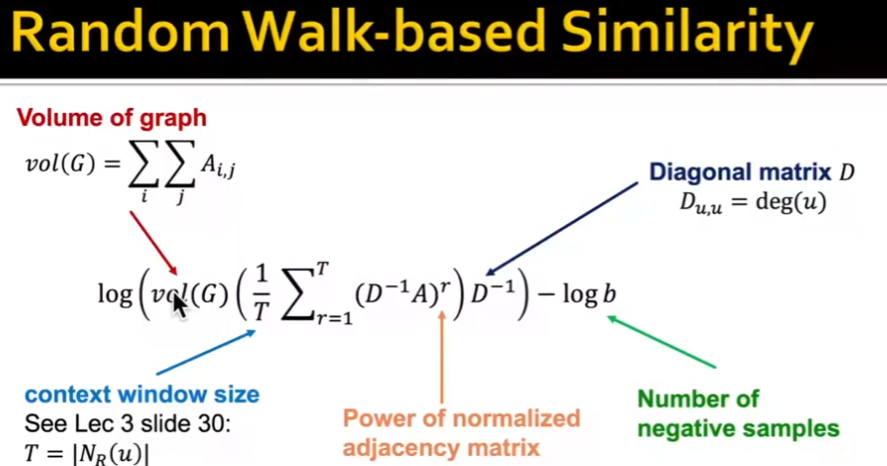
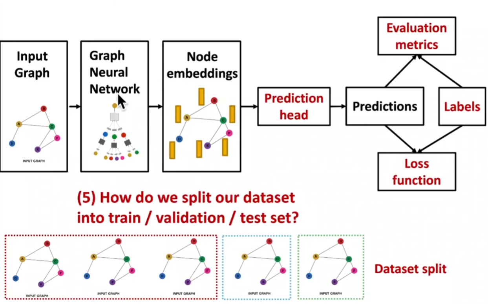

1. **Betweenness Centrality**  
   Betweenness centrality \( c_v \) measures the extent to which a node \( v \) lies on the shortest paths between other nodes.  

   $$
   c_v = \sum_{s \neq v \neq t} \frac{\sigma_{st}(v)}{\sigma_{st}}
   $$

   - \( \sigma_{st} \): The number of shortest paths between nodes \( s \) and \( t \).  
   - \( \sigma_{st}(v) \): The number of shortest paths between \( s \) and \( t \) that pass through \( v \).

---

2. **Closeness Centrality**  
   Closeness centrality \( c_v \) quantifies how close a node \( v \) is to all other nodes in the network.  

   $$
   c_v = \frac{1}{\sum_{u \neq v} d(u, v)}
   $$

   - \( d(u, v) \): The shortest path length between node \( u \) and node \( v \).

### (2) Clustering Coefficient 
\[
e_v = \frac{\text{Number of edges between neighbors of } v}{\binom{k_v}{2}}, \quad \binom{k_v}{2} = \frac{k_v (k_v - 1)}{2}
\] 

### (3) Graphlet: Rooted connected non-isomorphic subgraphs  
Graphlet degree vector  
Clustering coefficient.
Feature-based/ structure-based features.

## Link
### (1) Link prediction
1. Links missing at random: Remove a random set of links and then aim to predict them
2. Links over time: Given $G[t_0, t_0']$ a graph on edges up to time $t_0'$, output a ranked list $L$ of links (not in $G[t_0, t_0']$) that are predicted to appear in $G[t_1, t_1']$

### (2) Local Neighborhood Overlap
- Common neighbors: $|N(v_1) \cap N(v_2)|$
- Jaccard's coefficient: $\frac{|N(v_1) \cap N(v_2)|}{|N(v_1) \cup N(v_2)|}$,  
  Normalize common neighbor, assuming having the same number of neighbors
- Adamic-Adar index: $\sum_{u \in N(v_1) \cap N(v_2)} \frac{1}{\log k_u}$,  
  Penalize those who have many neighbors

### (3) Global Neighborhood Overlap 
- Katz index: $S_{uv}= \sum_{l=1}^{\infty} \beta^l A^l_{uv}$,  
  $A^l_{uv}$: number of paths of length $l$ between $u$ and $v$,  
  $\beta$: discount factor, the contribution of long paths  
- Katz index matrix: $S= \sum_{i=1}^\infty \beta^iA^i = (I-\beta A)^{-1}-I$ 

## Graph  
### Kernel method:
1. **Kernel function**:  
   $K(G, G')$ measures the similarity between two graphs $G$ and $G'$.  
   Maps the graphs into a higher-dimensional space where linear methods can be applied to perform complex, non-linear tasks in the original space.
   
2. **Kernel Matrix**: $\mathbf{K} = \left( K(G, G') \right)_{G, G'}$ is a symmetric matrix.  
   It is positive semidefinite, meaning all its eigenvalues are non-negative.
   
3. **Feature Representation**:  
   Feature mapping $\phi(\cdot)$ kernel function is expressed as dot product in feature space: $K(G, G') = \phi(G)^\top \phi(G')$.
   
cite: [CSDN Blog](https://blog.csdn.net/PolarisRisingWar/article/details/115598815)

### Design graph feature vector $\phi(G)$
**Bag-of-Words: BoW**  
Key idea: use the word counts as features (#nodes as features, #degree, #graphlet, #color)

### Graphlet features
Key idea: Count the number of different graphlets in a graph.  
$G_k=(g_1, g_2, \cdots, g_{n_k})$

Graphlet count vector $(f_G)=\#(g_i \subseteq G), \; i \leq n_k$

$h_G= \frac{f_G}{\text{Sum}(F_G)}$,  
$K(G, G')=H_G^\top H_G'$

NP-hard $O(nd^{k-1})$, expensive to calculate 

### Weisfeiler-Lehman Kernel
[Weisfeiler-Lehman Kernel Blog](https://blog.csdn.net/PolarisRisingWar/article/details/117336622)

# 3 Node Embedding
## 3.1 Intro
Key: How to define node similarity  

<!-- Avoid direct Feature Engineering, and also reflect structural features -->
### Encoder
Feature representation ↔ feature embedding  
<!-- If two nodes are similar in structure, they should be similar in embedding space -->
<!-- Use dot product to measure similarity -->
Similarity $(u, v) \approx z_u^T z_v$,  
$ENC(u) = z_u$, $ENC(v) = z_v$, <!--ENC: Encoder-->  
$z_u, z_v$ are $d$-dimensional in embedding space, $d$ usually 64-1000  
$ENC(v)$ node in the input graph

$ENC(v) = z_v = Z \cdot v$  
Encoder is a lookup, embedding matrix $Z \in \mathbb{R}^{d \times |V|}$, $v \in I^{|V|}$

#### ENC
Shallow encoder: $d \times |V|$  
Some ways for ENC: DeepWalk, Node2Vec

## 3.2 Random walk for Node Embedding
### Notation
- Vector $z_u$: embedding vector of node $u$ (what we aim to find)
- $P(v|z_u)$: probability of visiting node $v$ on random walk starting from $u$. Used to measure similarity. 
- Softmax: $\sigma(z)_i = \frac{e^{z_i}}{\sum e^{z_j}}$
- Sigmoid: $S(x) = \frac{1}{1 + e^{-x}}$

### Random walk embedding
Using random strategy $R$: $P_R(u|v)$  
Given  
$G=(V, E)$  
Goal: Learn a mapping $f: u \rightarrow \mathbb{R}^d$  
$$
\mathcal{L} = \sum_{u \in V} \sum_{v \in N_R(u)} -\log\left(\frac{\exp(z_u^\top z_v)}{\sum_{n \in V} \exp(z_u^\top z_n)}\right)
$$  
**Negative sampling**  
$$
\log\left(\frac{\exp(z_u^\top z_v)}{\sum_{n \in V} \exp(z_u^\top z_n)}\right) \approx \log\left(\sigma(z_u^\top z_v)\right) - \sum_{i=1}^{k} \log\left(\sigma(z_u^\top z_{n_i})\right), \quad n_i \sim P_V
$$ -->

### Random walk strategy 
#### DeepWalk
[DeepWalk Paper](https://www.vldb.org/pvldb/vol10/p13-wu.pdf)

#### Node2Vec
Node2Vec

**Hyperparameters:**
- $p$: Return parameter
- $q$: In-out parameter 

## 3.3 Embedding Entire Graph
### Approach 1
Sum/mean $z_G = \sum_{v \in G} z_v$  
[Embedding Entire Graph](https://arxiv.org/pdf/1509.09292)

### Approach 2
Virtual node  
[Virtual Node Paper](https://arxiv.org/pdf/1511.05493)

### Approach 3
Anonymous walk:
#### Sampling Anonymous walks
Distribution have error less than $\epsilon$ with probability, less than $\delta$  
$m = f(\epsilon, \sigma, \delta)$

#### Walk Embedding
$\Delta$

# 4 Node Embedding using Random walk - PageRank
## 4.1 Intro
PageRank: $r_v = \sum_{u \in N_R(v)} r_u \frac{A_{u,v}}{d_u}$  
$d_u$: degree of node $u$  
$A_{u,v}$: adjacency matrix  
$r_v$: rank of node $v$  
$N_R(v)$: neighbors of node $v$

## 4.2 PageRank for Graph
$r_v = \sum_{u \in N_R(v)} r_u \frac{A_{u,v}}{d_u}$  
$d_u$: degree of node $u$  
$A_{u,v}$: adjacency matrix  
$r_v$: rank of node $v$  
$N_R(v)$: neighbors of node $v$

## 
$r_v = \sum_{u \in N_R(v)} r_u \frac{A_{u,v}}{d_u}$

## 
- Personalized PageRank (Topic specific PageRank)  
  Rank proximity of nodes to the teleport nodes $S$,  
  Proximity on graphs: 
- PageRank with restarts:

### Matrix Factorization
Frobenius norm: $\min_z ||A - Z^\top Z||$  

# 5 Message passing & Node Classification
Classical methods

**Correlation:** nearby nodes have the same color  
$A_{n \times n}$: Adjacency matrix  
$Y = \{0, 1\}^n$

## Collective Classification:
1. Local classifier 
2. Relational Classifier 
3. Collective Inference  
   $1^{st}$ order Markov assumption: $P(Y_v) = P(Y_v | N_v)$

- Relational classification
- Iterative classification 
- Belief propagation

# 6 GNN Model 

# 7 GNN Design Space

# 8 Training GNN 
## 8.1 Data augmentation
### Feature based 
### Structure based

## 8.2 

## 8.3 

**Node Prediction**  
- Transductive setting
- Inductive setting 

**Training**  
Validation (tuning hyperparameters)  
Test set

**Graph Prediction**  
- Link Prediction -->

# 9 Theory of GNN
GCN, GAT, GraphSAGE, design space 

## 9.1

## 9.2
GCN Mean pooling fails  
GraphSAGE mean-pool 

Injective Multiset function: $\Phi(\cdot)$: a non-linear function:  
$\Phi(\sum_{x \in S} f(x))$:  
Multi-layer Perceptron  
**Theorem:** Universal approximation theorem  
A neural network can model any injective multiset function:  
$MLP_{\Phi}(\sum_{x \in S} MLP_{f}(x))$

**Graph Isomorphism Network (GIN) Xue 2019** 

**WL Graph Kernel**  
Hash  
$$
\left( c^{(k)}(v), \{ c^{(k)}(u) \}_{u \in N(v)} \right) 
$$

$$
\text{MLP}_{\Phi} \left( (1 + \epsilon) \cdot \text{MLP}_{f}(c^{(k)}(v)) + \sum_{u \in N(v)} \text{MLP}_{f}(c^{(k)}(u)) \right) 
$$

where $\epsilon$ is a learnable scalar

$$
c^{(k+1)}(v) = \text{HASH} \left( c^{(k)}(v), \{ c^{(k)}(u) \}_{u \in N(v)} \right)
$$

$$
\text{GINConv} \left( c^{(k)}(v), \{ c^{(k)}(u) \}_{u \in N(v)} \right) = \text{MLP}_{\Phi} \left( (1 + \epsilon) \cdot c^{(k)}(v) + \sum_{u \in N(v)} c^{(k)}(u) \right)
$$

# 10 Heterogeneous Graphs and Knowledge Graph Embeddings
## 10.1
### Heterogeneous Graphs 
$G=(V, E, R, T)$

## RGCN

# VGAE
讲的比较好的GAE和VGAE
1. [AtYun Article](https://www.atyun.com/17976.html)
2. [Spaces Article](https://spaces.ac.cn/archives/5253#%E7%BB%88%E7%82%B9%E7%AB%99)
3. [CSDN Blog](https://blog.csdn.net/qq_16763983/article/details/120403055?spm=1001.2101.3001.6650.7&utm_medium=distribute.pc_relevant.none-task-blog-2%7Edefault%7EBlogCommendFromBaidu%7ERate-7-120403055-blog-119531815.235%5Ev43%5Epc_blog_bottom_relevance_base8&depth_1-utm_source=distribute.pc_relevant.none-task-blog-2%7Edefault%7EBlogCommendFromBaidu%7ERate-7-120403055-blog-119531815.235%5Ev43%5Epc_blog_bottom_relevance_base8&utm_relevant_index=13)

### CNN code
1. CNN 网络结构与部分 PyTorch: [CNBlogs 1](https://www.cnblogs.com/wpx123/p/17616156.html), [CNBlogs 2](https://www.cnblogs.com/wpx123/p/17621303.html)

#### Optimizer：
SGD, GD, Adam 都是 Optimizer 的种类
1. [PyTorch 源代码解读](https://zhuanlan.zhihu.com/p/346205754), 以及各种参数 lr, gamma 的影响
2. [简单讲解了 SGD， Adam 的原理](https://blog.csdn.net/xian0710830114/article/details/126551268)

### 一个比较有用的 Casual Inference 综述的博客：
[Casual Inference 综述](https://www.cnblogs.com/caoyusang/p/13518354.html)
