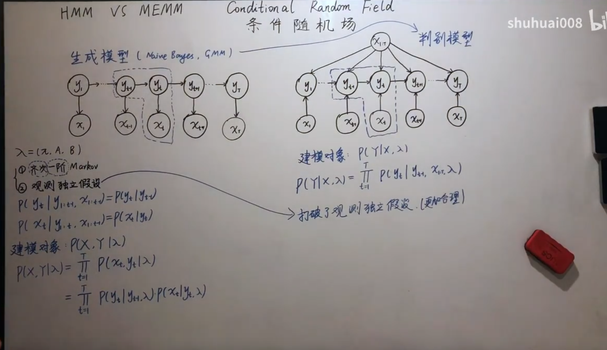
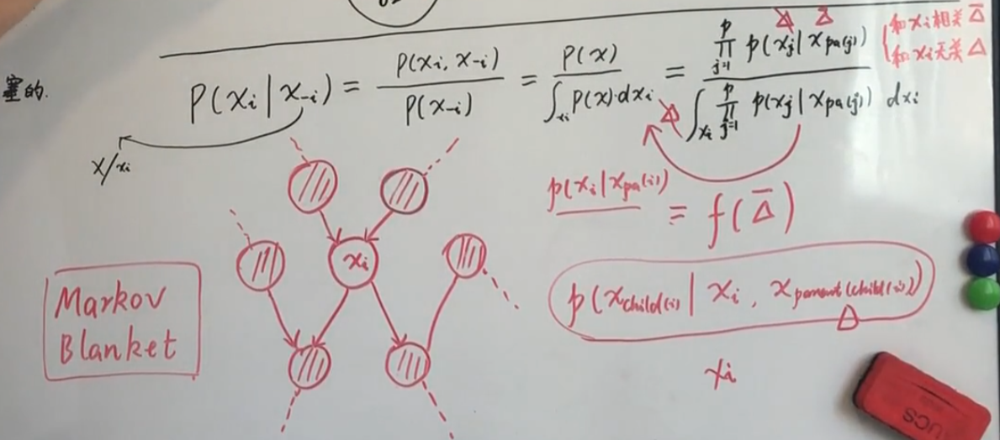
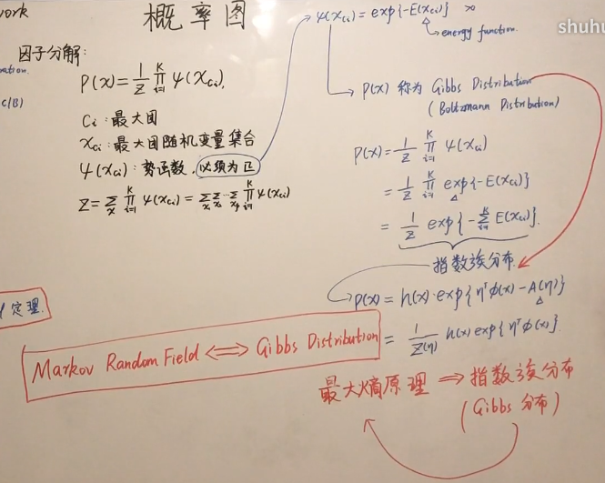

---
title: Casual Inference
date: 2024-05-29 13:53:31
tags:
mathjax: true
---


## 与贝叶斯有关的
频率派的观点
为 $p(X|\theta)\mathop{=}\limits_{iid}\prod\limits _{i=1}^{N}p(x_{i}|\theta)$ 

为了求常量 $\theta$ 的大小,最大对数似然MLE的方法：
$\theta_{MLE}=\mathop{argmax}\limits _{\theta}\log p(X|\theta)\mathop{=}\limits _{iid}\mathop{argmax}\limits _{\theta}\sum\limits _{i=1}^{N}\log p(x_{i}|\theta)$


贝叶斯派的观点
$p(x|\theta)$ 中的 $\theta$ 不是一个常量。这个 $\theta$ 满足一个预设的先验的分布 $\theta\sim p(\theta)$

$p(\theta|X)=\frac{p(X|\theta)\cdot p(\theta)}{p(X)}=\frac{p(X|\theta)\cdot p(\theta)}{\int\limits _{\theta}p(X|\theta)\cdot p(\theta)d\theta}$

为了求 $\theta$ 的值，我们要最大化这个参数后验MAP：

$\theta_{MAP}=\mathop{argmax}\limits _{\theta}p(\theta|X)=\mathop{argmax}\limits _{\theta}p(X|\theta)\cdot p(\theta)$


#


基础知识和概念，包括d-分离
do算子
后门调整
前门调整
逆概率加权
反事实
因果关系发现中最基本的两类方法：基于独立性测试的方法，以及通过加性噪声模型的形式分析残差与预测者独立性关系的方法

## chap1
partition, law of total probability
summing up its probabilities over all Bi is called marginalizing over $B$, and the resulting probability P(A) is called the marginal probability of $A$.
$P(A)=P(A,B_1)+P(A,B_2)+···+P(A,B_n)$

Def conditional probabilities
$P(A|B)=P(A,B)∕P(B)$


independence, giving no additional information
$P(A,B)=P(A)P(B)$

$P(A|B)=\frac{P(B|A)P(A)}{P(B)}$


$P(A)=P(A|B_1)P(B_1)+P(A|B_2)P(B-2)+···+P(A|B_k)P(B_k)$

Sructual Casual Models SCM
U exogenous variables, external to the model;


## HMM
https://www.yuque.com/bystander-wg876/yc5f72/dvgo5b
机器学习模型可以从频率派和贝叶斯派
频率派的方法中的核心是优化问题，而在贝叶斯派的方法中，核心是积分问题，也发展出来了一系列的积分方法如变分推断，MCMC 等
### Def
$\lambda=(\pi,A,B)$
  
- $\pi$ is the initial state distribution
- $o_t$ 来表示观测变量，$O$ 为观测序列，$V=\{v_1,v_2,\cdots,v_M\}$ 表示观测的值域
- $i_t$ 表示状态变量，$I$ 为状态序列，$Q=\{q_1,q_2,\cdots,q_N\}$ 表示状态变量的值域
- $A=(a_{ij}=p(i_{t+1}=q_j|i_t=q_i))$状态转移矩阵
- $B=(b_j(k)=p(o_t=v_k|i_t=q_j))$ 发射矩阵
- 

#### 两个基本假设
1. 齐次 Markov 假设（未来只依赖于当前）： 
$p(i_{t+1}|i_t,i_{t-1},\cdots,i_1,o_t,o_{t-1},\cdots,o_1)=p(i_{t+1}|i_t)$
2. 观测独立假设： 
$p(o_t|i_t,i_{t-1},\cdots,i_1,o_{t-1},\cdots,o_1)=p(o_t|i_t)$

#### 三个基本问题
1. Evaluation：$p(O|\lambda)$，Forward-Backward 
2. Learning：$\lambda=\mathop{argmax}\limits_{\lambda}p(O|\lambda)$，EM （Baum-Welch）
3. Decoding：$I=\mathop{argmax}\limits_{I}p(I|O,\lambda)$，Vierbi 算法
  a. 预测问题：$p(i_{t+1}|o_1,o_2,\cdots,o_t)$
  b. 滤波问题：$p(i_t|o_1,o_2,\cdots,o_t)$


##
##


## 有关MCMC
一个比较基础的介绍： https://zhuanlan.zhihu.com/p/420214359
- Abstract:
  - 贝叶斯推断估计参数的方法是：我们可以算出参数$\Theta$的分布函数$P(\Theta)$，我们用参数分布的数学期望作为对参数的估计值
  - MCMC的作用是：可以帮我们从任意（无论有没有解析形式的）分布上抽样一批数据，然后用这堆抽样数据的均值作为对这个分布期望的估计
  - 我们用MCMC这种求期望的方法求参数分布期望的估计值，以此求出参数的估计值
  - 
### 1 Monte Carlo Sampling
如果$X$服从$f(x)$这个概率分布，我怎么获得$E(X)$\
最常见的一种Monte Carlo方法的使用场景就是：对随机变量进行充分多的采样后，使用这些采样的均值来估计总体的期望

对于随机变量$X$，它的概率密度函数为$p(x)$，因此它的数学期望为
$E(x)=\int_{-\infty}^{+\infty}xp(x)dx$\
我们对于这个随机变量随机采样得到$n$个采样值$x_i$，根据大数定理，有
$\lim_{n\rightarrow+\infty}{\frac1n\sum_i^n{x_i}}=E(X)$

### 2 Bayes & MCMC
#### 2.1 Bayes Model: 参数$\Theta$ ，Observed data: $D$
   
贝叶斯公式：$P(\Theta|D)=\frac1{P(D)}P(D|\Theta)P(\Theta)$

由于$P(D)$是一个无关紧要的常数，因此上式往往直接写成一个正比关系式：
$P(\Theta|D)\propto P(D|\Theta)P(\Theta)$

在贝叶斯推断里：
1. 通过$P(\Theta|D)$来得到$\Theta$的估计值
2. 模型给出$P(D|\Theta)$， 即likelihood$P(D|\Theta)$
3. 还可以通过$P(\Theta)$来对参数的分布情况做一些先验的猜测。（如果你什么都不知道，$P(\Theta)$自然可以猜一个均匀分布）

#### 2.2 通过后验概率$P(\Theta|D)$获取参数$\Theta$的估计值
想法：众数或者期望作为
估计值
1. 众数：$\hat\Theta=\arg\max_\Theta{P(\Theta|D)}$
2. 期望：$\hat\Theta=\int_\Theta\Theta P(\Theta|D)d\Theta$


MCMC就是教我们怎么在一个没有解析形式的数据上「抽样几个数据算平均值」的方法


### 3 Sampling 采样
1. Uniform
2. Gaussian: 
   Given $U_1,U_2$    
     $$
      Z_0 = \sqrt{-2 \ln U_1} \cos(2\pi U_2)
      $$
      $$
      Z_1 = \sqrt{-2 \ln U_1} \sin(2\pi U_2)
      $$
3. Reject-Accept: 用于对很不规则的$f(x)$采样。具体细节没看
4. 


### Markov Chain
一个对马尔可夫状态讲的比较详细的文章：
https://zhuanlan.zhihu.com/p/250146007
#### Def
转移概率矩阵：

$P=\begin{bmatrix}p_{11} & p_{12} &p_{13} \\ p_{21} & p_{22} &p_{23} \\ p_{31} & p_{32} &p_{33}\end{bmatrix}$ 

其中 $p_{ij}=P(X_{t}=i|X_{t-1}=j)$ 。

定义：马尔科夫链在 $t$ 时刻的概率分布称为 $t$ 时刻的状态分布：

$\pi (t)=\begin{bmatrix}\pi_{1}(t) \\ \pi_{2}(t) \\ \pi_{3}(t)\end{bmatrix}$ 

其中  $\pi_{i} (t)=P(X_{t}=i),i=1,2,...$ 。
#### 性质
1. 定理：给定一个马尔科夫链 $X=\left\{ X_0,X_1,...,X_t,... \right\}$ ， $t$ 时刻的状态分布：
 $\pi=(\pi_1,\pi_2,...)$ 是 $X$ 的平稳分布的条件是 $\pi=(\pi_1,\pi_2,...)$ 是下列方程组的解：
 $x_{i}=\sum_{j}{p_{ij}x_j},i=1,2,...$ 
 $x_i\geq0,i=1,2,...$ 
 $\sum_{i}{x_{i}=1}$

2. 


### MCMC具体细节
https://zhuanlan.zhihu.com/p/253784711


## Conditional Random Field(CRF)
- HMM 生成模型
- MEMM Maximum Entropy Markov Model




- HMM:
  $$ P(\mathbf{X}, \mathbf{Y} | \lambda) = P(\mathbf{Y} | \lambda) P(\mathbf{X} | \mathbf{Y}, \lambda) $$
- MEMM:
  $$ P(y_t | y_{t-1}, x_t) $$
- CRF:
  $$ P(\mathbf{Y} | \mathbf{X}, \lambda) = \frac{1}{Z(\mathbf{X})} \exp \left( \sum_{t=1}^{T} \lambda_t f(y_t, y_{t-1}, \mathbf{X}, t) \right) $$


## 概率图模型
https://www.bilibili.com/video/BV1BW41117xo/?spm_id_from=333.999.0.0&vd_source=441679270dda23308fe16f3c5602b058


### 概率和图
概率图
- 表示 Representation
  - 有向图 Beyesian Netowrk
  - 无向图
  - 高斯图（连续的随机变量）
- 推断 Inference
  - 精确推断
  - 近似推断
    - 确定性推断（变分）
    - 随机近似 MCMC
- 学习
  - 参数学习
    - 完备数据
    - 隐变量
  - 结构学习


高维随机变量
  - sum: $P(x_1) = \int P(x_1, x_2)dx_2$
  - product: $P(x_1|x_2) = P(x_1|x_2)P(x_2)=P(x_2|x_1)P(x_1)$

链式法则
- $$P(X_1,X_2,...,X_n)=P(X_1)P(X_2|X_1)P(X_3|X_2,X_1)···P(X_n|X_{n-1},X_{n-2},...,X_1)$$


全概率公式
  - $P(X_i)=\sum_{j}{P(X_i,X_j)}=\sum_{j}{P(X_i|X_j)P(X_j)}$

贝叶斯公式
  - $P(X_i|X_j)=\frac{P(X_i,X_j)}{P(X_j)}=\frac{P(X_i|X_j)P(X_j)}{P(X_j)}$


困境： 
维度高$P(X_1,X_2,...,X_n)$计算复杂
- 1.假设$X_i$相互独立:
  - $P(X_1,X_2,...,X_n)=\prod_{i}{P(X_i)}$
- 2.Markov Property(HMM齐次马尔可夫):
  - $x_j\perp x_i+1|x_i, j<i$ 
  - $P(X_1, X_2,...,X_n)=P(X_1)P(X_2|X_1)P(X_3|X_2,X_1)···P(X_n|X_{n-1},X_{n-2},...,X_1)$
- 3.假设$X_i$条件独立: 
  - $x_a\perp x_b|x_c$
  - $P(X_1,X_2,...,X_n)=\prod_{i}{P(X_i|X_{i-1})}$
#### 概率补充知识
指数族分布
- 充分统计量$\phi(x)$
- 共轭
- 最大熵
- 广义线性模型
- 概率图模型
- 变分推断
  
充分统计量
- $P(x|\eta)=h(x)\exp(\eta^T\phi(x)-A(\eta))$
  - $h(x)$: base measure
  - $\eta$: parameter 参数向量
  - $\phi(x)$: feature function
  - $A(\eta)$： log partition function 配分函数
- $P(x|\theta)=\frac{1}{z}\hat P(x|\theta)$
  - $z=\int \hat P(x|\theta)dx$ 归一化因子
- $P(x|\eta)=h(x)\exp(\eta^T\phi(x)-A(\eta))$
  - $=\frac{1}{exp(A(\eta))}h(x)exp(\eta^T\phi(x))$
  - $=\frac{1}{z}\hat P(x|\eta)$
    - $\hat P(x|\eta)=h(x)exp(\eta^T\phi(x))$
    - $z=exp(A(\eta))$

共轭, 先后验分布同组方便计算
- $P(\theta|x)=\frac{P(x|\theta)P(\theta)}{P(x)}$
- $P(\theta|x)$和$P(x|\theta)$属于同一个指数族
- $P(\theta|x)$的参数是$P(\theta|x)$的参数的函数

先验
- 共轭 - 计算方便
- 最大熵 无信息先验
- Jerrif

广义线性模型
- 线性组合 $w^Tx$
- Link funciton ->aactivation function
- 指数分布 $y|x\sim$指数组分布（$Bernulli, Poisson, N(\mu, \Sigma)$）

##### Gaussian
- $P(x|\mu,\Sigma)=\frac{1}{(2\pi)^{n/2}|\Sigma|^{1/2}}\exp\left(-\frac{1}{2}(x-\mu)^T\Sigma^{-1}(x-\mu)\right)$
- $\eta=
\left(\!
    \begin{array}{c}
      \eta_1 =\frac{\mu}{\sigma^2}\\
      \eta_2=-\frac{1}{\sigma^2}
    \end{array}
    \!\right)$
- $\phi(x)=\left(\!
    \begin{array}{c}
      x\\
      x^2
    \end{array}
    \!\right)$
- $A(\eta)=-\frac{\eta_1^2}{4\eta_2}+\frac{1}{2}\ln(-\frac{\pi}{\eta_2})$

####
- $P(x | \eta) = h(x) \exp (\eta^T \phi(x) - A(\eta))$
  - $\eta$: 参数 (parameter)
  - $\phi(x)$: 充分统计量 (sufficient statistics)
  - $A(\eta)$: 对数配分函数 (log partition function)

1. $A'(\eta) = \mathbb{E}_{P(x|\eta)}[\phi(x)]$
2. $A''(\eta) = \text{Var}[\phi(x)]$
3. $A(\eta)$ 是凸函数 (convex function)

对这个函数求导
- $\exp(A(\eta)) = \int h(x) \exp(\eta^T \phi(x)) \, dx$
- $A'(\eta) = \frac{\partial}{\partial \eta} \log \left( \int h(x) \exp(\eta^T \phi(x)) \, dx \right)$
- $A'(\eta) = \int \frac{h(x) \exp(\eta^T \phi(x)) \phi(x) \, dx}{\exp(A(\eta))}$
- $A'(\eta) = \int P(x | \eta) \phi(x) \, dx = \mathbb{E}_{P(x|\eta)}[\phi(x)]$

##### MLE
$D=\{x_1, \cdots, x_N\}$

$\eta_{MLE}=\text{argmax  } log(P(D|\eta))$
- $=\sum_{i=1}^N\text{argmax  }log\cdot h(x_i)+(\eta^T \phi(x_i) - A(\eta))$
- - $=\sum_{i=1}^N\text{argmax  }\eta^T \phi(x_i) - A(\eta)$

set $\frac{\partial \eta_{MLE}}{\partial \eta}=0$
- $\sum \phi(x_i)-NA'(\eta)=0$

##### Entorpy 最大熵
信息熵 $-log\ p$
熵，（对可能性的衡量）
- $E_{p(x)}[-log\ p]=\int -p(x)log\ p(x)dx= \sum -p(x)log\ p(x)$
  


- $\hat p_i=\text{argmax } H(p)$ 
- 拉格朗日$\mathcal{L}(p, \lambda)=\sum p_ilog\ p_i$
  - $\frac{\partial \mathcal{L}}{\partial p_i}=log\ p_i+1-\lambda$
  - $\hat p_i=exp(\lambda-1)=1/k$

##### 经验分布
$Data = \{x_1, \cdots, x_N\}$

- **频率分布**： $P(x_1, x_2, \ldots, x_n) \approx \hat{P}(x) = \frac{\text{count}(x)}{N}$
- **经验期望**： $\mathbb{E}_p[f(x)] = \Delta \approx \frac{1}{N} \sum_{i=1}^N f(x_i)$

最大熵问题的求解
$$
\begin{aligned}
\min_{p(x)} & \sum_x p(x) \log p(x) \\
\text{subject to} & \sum_x p(x) = 1 \\
& \mathbb{E}_p[f(x)] = \mathbb{E}_{\hat{p}}[f(x)] = \Delta
\end{aligned}
$$

拉格朗日乘数法求解
$$
\begin{aligned}
L(p, \lambda, \eta) &= \sum_x p(x) \log p(x) + \lambda (1 - \sum_x p(x)) + \eta (\Delta - \sum_x p(x) f(x)) \\
\frac{\partial}{\partial p(x)} &= \log p(x) + 1 - \lambda_0 - \lambda f(x) = 0 \\
p(x) &= \exp(\lambda_1 f(x) + \lambda_0 - 1) \\
&= \frac{\exp(\eta^T f(x))}{Z(\eta)}
\end{aligned}
$$

### 贝叶斯网络
有向无环图
因子分解
- $P(X_1,X_2,...,X_n)=\prod_{i}{P(X_i|Pa(X_i))}$
- $P(X_i|Pa(X_i))$是局部概率分布
- $Pa(X_i)$是$X_i$的父节点集合
#### 三种模型
##### tail-to-tail
  ```mermaid
  graph LR;
    a--> b
    a--> c
  ```
因子分解：
- $P(a, b, c)=P(a)P(b|a)P(c|a)$

链式法则：
- $P(a, b, c)=P(a)P(b|a)P(c|a, b)$
  
$\implies P(c|a)=P(c|a, b)\implies c\perp b |a$
若$b$ 被观测则路径被阻塞： 

##### head-to-tail
  ```mermaid
  graph LR;
    a -->b 
    b -->c 
  ```
$a\perp c |b$
若$b$ 被观测则路径被阻塞： 

##### head-to-head
  ```mermaid
  graph LR;
    b--> c
    a--> c
  ```
- $P(a, b, c)=P(a)P(b)P(c|a, b)$
- $P(a, b, c)=P(a)P(b|a)P(c | a, b)$

$\implies P(b)=P(b|a)\implies a\perp b$
若$b$ 被观测则路径被连通：

#### D-seperation
  ```mermaid
  graph LR;
    a  --> b1
    a  --> b2
    a  --> b*
    b1 --> c
    b2 --> c
    c  --> b*
  ```
- 如果$b1, b2\in B$被观测了
，那么$a$和$c$被阻断，
- 但是$b*$没有被观测到,且$b*$的后续节点都不在$b$中
$a\perp c|b$


马尔可夫毯(Markov Blanket)
- $x_{pa(i)}$：$x_i$的父节点
- $x_{child(i)}$: childs of $x_i$
- $x_{pa(child(i))}$: parent of $x_{child(i)}$
- $x_{-i}=x/x_i$ 表示除了 $x_i$ 以外的所有变量。
  - 和$x$有关:$\Delta$
    - $P(x_i|x_{Pa(i)})=f(\bar \Delta)$
  - 和$x$无关:$\bar \Delta$

马尔可夫毯的作用是在给定马尔可夫毯内所有节点的情况下，$x_i$ 与网络中其他节点条件独立。

$$
P(x_i | x_{-i}) = \frac{P(x_i, x_{-i})}{P(x_{-i})} = \frac{P(x)}{\int_{x_i} P(x_{-i})} = \frac{ \int_{x_i} P(x) \, dx_i }{ \int_{x_i} P(x_j | x_{\text{pa}(j)}) \, dx_i }
$$


$$
P(x_{\text{child}(i)} | x_i, x_{\text{Parent}(\text{Child}(i))})
$$

#### 贝叶斯网络 Beyesian Network
NB
  ```mermaid
  graph LR;
    y--> x1 
    y--> xp
  ```

GMM
  ```mermaid
  graph LR;
    z--> x

  ```
Beyesian Network
- 单一： Naive Bayes
  - p维： $P(x|y)=\prod^p_{i=1}P(x_i|y=1)$
  - $x_1\perp x_2|y$
- 混合：GMM
  - Z discrete, z=1,2,3,4
- 时间
  - Markov Chain
  - Gaussian Process(无限维分布)
- 连续： Gaussian Network

动态模型
- HMM 离散
- LDS Kalman Filter 连续线性
- Particle filter 非线性非高斯


### Markov Network
条件独立性
- 全局 Global Markov Property
  - $X_A \perp X_C \mid X_B$
  - 如果集合 $X_A$ 和 $X_C$ 被集合 $X_B$ 分隔开，那么 $X_A$ 和 $X_C$ 是条件独立的
- 局部 Local Markov Property
  - $a \perp \{Non-Neighbour\} \mid \{Neighbour\}$
  - { }：集合
- 成对 Pairwise Markov Property
  - $x_i \perp x_j \mid x_{-ij}$
  - 如果节点 $x_i$ 和 $x_j$ 直接相连，那么在给定其他所有节点的情况下，$x_i$ 和 $x_j$ 是条件独立的


#### Factorization
团: Clique
最大团: Maximal Clique
$$
P(X) = \frac{1}{Z} \prod_{i=1}^K \psi(X_{C_i})
$$
- $c_i$ 最大团
- $x_{c_i}$: 最大团随机变量集合
- $\psi(x_{c_i})$: 势函数
- $Z$:
  - $Z = \sum_{X} \prod_{i=1}^K \psi(X_{C_i})$
- $\psi(X_{C_i})$ 是定义在最大团 $C_i$ 上的因子函数

何弃疗


### Inference

- 联合概率 Joint Probability
  - $P(X) = P(x_1, x_2, \ldots, x_p)$

- 边缘概率 Marginal Probability
  - $P(x) = \sum_{x_j} P(x_j)$

- 条件概率 Conditional Probability
  - $P(x_i | x_j)$, 其中$x_j = \{x \backslash x_i\}$

- 最大后验概率估计 MAP Inference
  - $\hat{z} = \arg \max_z P(z | x) \propto \arg \max_z P(z, x)$

---

-  精确推断 Exact Inference
   - Variable Elimination (VE)
   - Belief Propagation (BP) → Sum-Product Algorithm (求和-乘积算法)
   -  Junction Tree Algorithm (树形算法)

- 近似推断 Approximate Inference
  -  Loop Belief Propagation (循环信念传播)
  -  Monte Carlo Inference: Importance Sampling, MCMC (蒙特卡罗推断：重要性采样，MCMC)
  -  Variational Inference (变分推断)


#### Variable Elimination

$P(x) = \prod_{i} \phi_i(x_i)$

#### 示例

假设我们有四个二值随机变量 $a, b, c, d\in {0,1}$。我们想计算边缘概率 $P(d)$。
$a\rightarrow b \rightarrow c \rightarrow d$
1. 展开联合分布：
   - $P(d) = \sum_{a, b, c} P(a, b, c, d)$

2. Chain rule
   - $P(a, b, c, d) = P(a) P(b | a) P(c | b) P(d | c)$

3. 1->2
   - $P(d) = \sum_{a, b, c} P(a) P(b | a) P(c | b) P(d | c)$
     - $= \sum_{b, c} P(d | c) \left( \sum_{a} P(a) P(b | a) \right) P(c | b)$

4. 定义新的因子函数：
   - $\phi_1(b, c) = \sum_{a} P(a) P(b | a)$

5. 最终得到：
   - $P(d) = \sum_{c} P(d | c) \left( \sum_{b} \phi_1(b, c) P(c | b) \right)$

6. 得到另一个因子函数 $\phi_2(c, d)$：
   - $P(d) = \sum_{c} \phi_2(c, d)$


