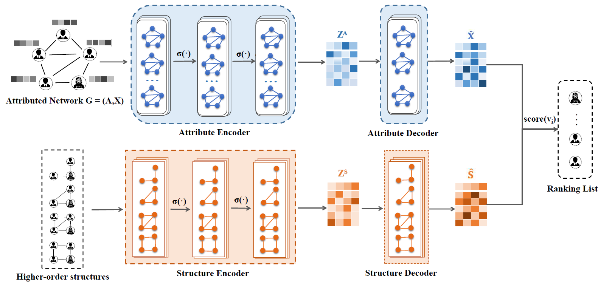
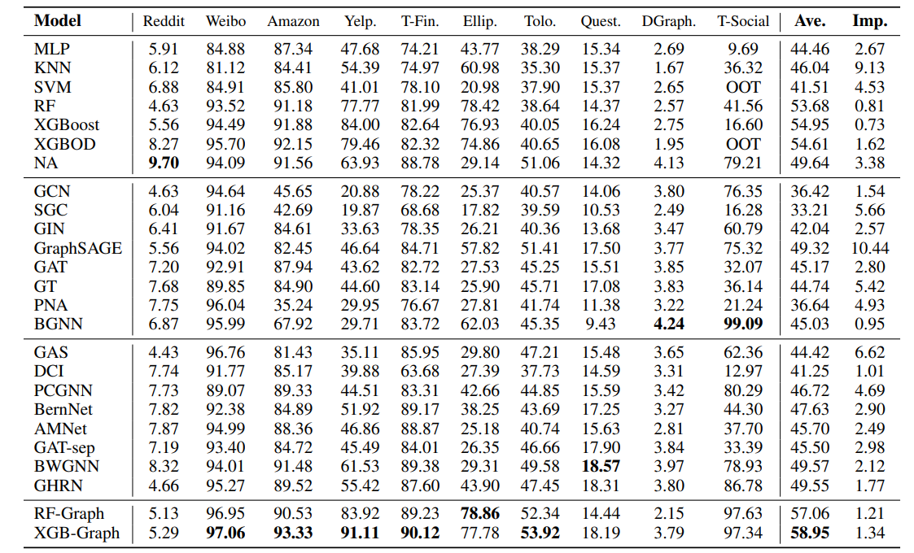
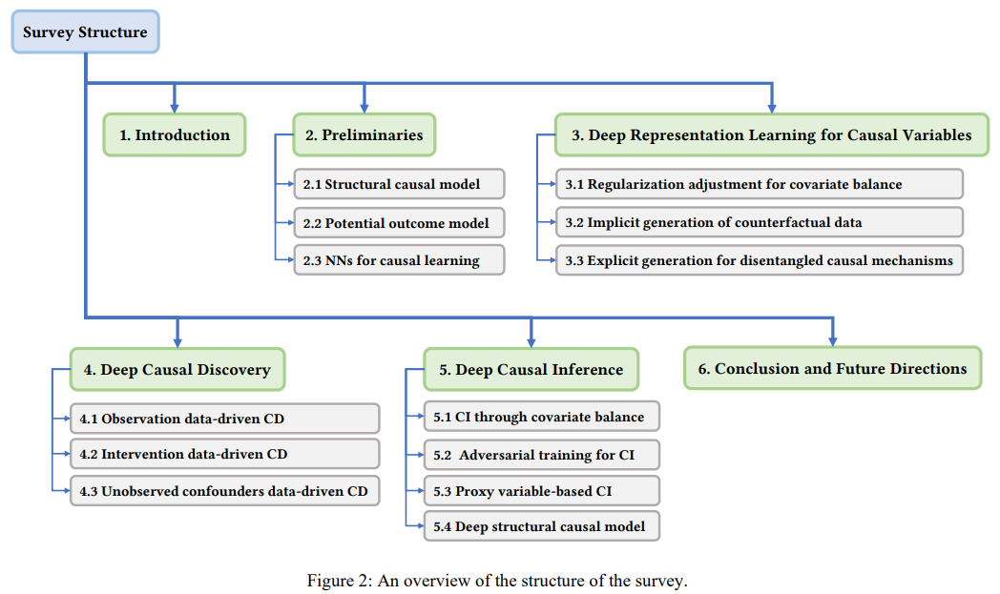
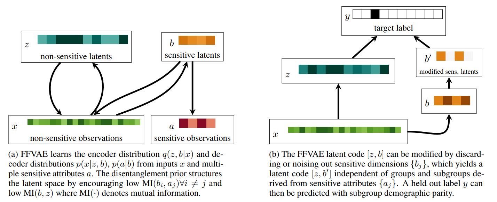
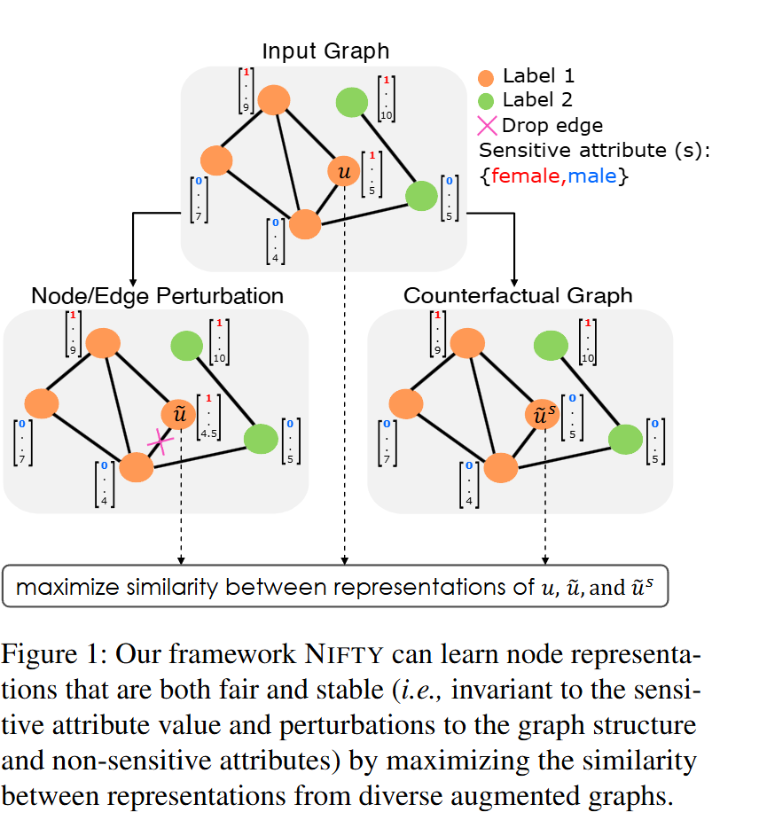
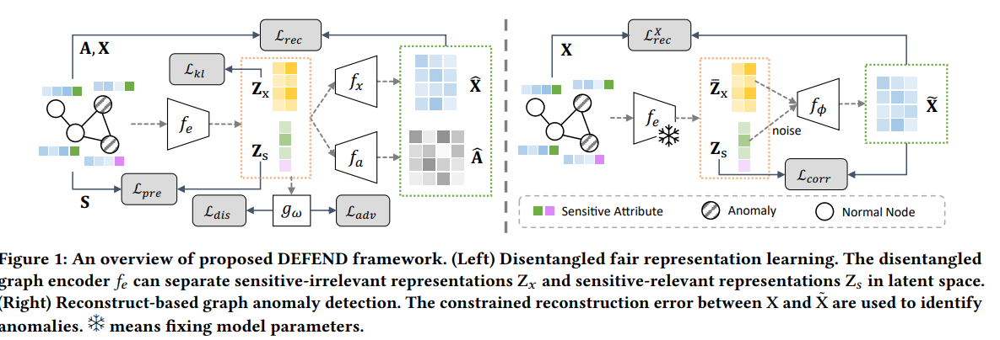
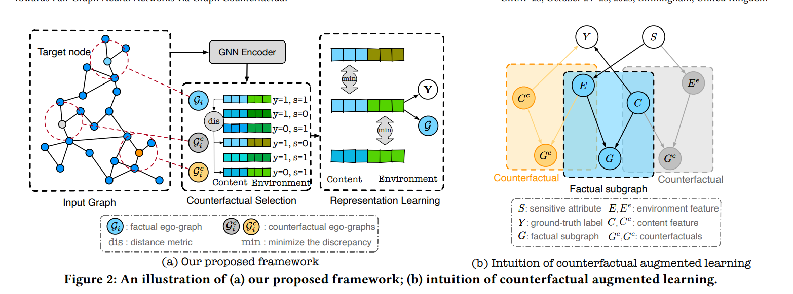
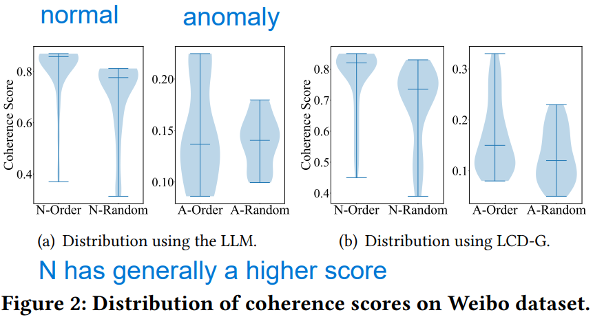

---
title: Papers Collection
date: 2024-07-14 21:24:36
tags:
mathjax: true
---
<!-- 

# Counterfactual fairness
Counterfactual fairness
link: https://proceedings.neurips.cc/paper_files/paper/2017/file/a486cd07e4ac3d270571622f4f316ec5-Paper.pdf

###
Definitions:
#### defs
$A$: Protected attributes, sensitive features\
$X$: features of individuals, excluding A\
$U$: latent features not observed, represented\
$Y$: predictor    
#### Fairness through unawareness (FTU):
_An algorithm is fair so long as any protected attributes $A$ are not explicitly used in the decision-making process._
Shortcoming: $X$ might intersects $A$

#### Individual Fairness (IF).
For distance metric(should be carefully choosen), $d(\cdot , \cdot)$, if $d(i, j)$ is small, then $\hat Y(X^{(i)}, A^{(i)}) \approx \hat Y(X^{(j)}, A^{(j)})$

#### Demographic Parity (DP)(人口统计学意义上的平等)
Predictor $\hat Y$ satisfies demographic partiy if $P(\hat Y|A=0)=P(\hat Y|A=1)$ 
#### Equality of Opportunity
$P(\hat Y|A=0, Y=1)=P(\hat Y|A=1, Y=1)$ 

### Causal Models(因果推断), Counterfacutal、
Casual Model $(U, V, F)$,\
$U$: latent background variables,\
$V$: observed variables, \
$F=\{f_1. f_2, \cdots, f_n\}$, for each $V_i=f_i(pa_i, U_{pa_i})\in V, pa_i \subseteq V \backslash {V_i}$ 

**Three Steps of Inference**\
- Abduction：for a given prior on $U$, compute the posterior distribution of $U$ given the evidence $W = w$
- Action：substitute the equations for $Z$ with the interventional values $z$, resulting in the modified set of equations $F_z$
- Prediction: 

# FairGAD
https://openreview.net/forum?id=3cE6NKYy8x

https://arxiv.org/abs/2307.04937
## Fair GAD problem
**GAD**\
$G=(V, E, X)$, \
node feature matrix $X\in \R^{n\times d}$, \
Adjacency matrix $A\in \{0,1\}^{n\times n}$, \
Anomaly labels $Y\in \{0, 1\}^n$, predicted $\hat Y$, \
**Fair GAD**\
sensitive attributes $S\in \{0, 1\}^n$, a binary feature $X$.\
Performance matrix: accuracy and _AUCROC_: Area under the ROC Curve \
Unfairness Mextrics, Statistic Parity(SP):$SP = |P(\hat Y=1|S=0)−P(\hat Y =1|S=1)|$, \
Equality of Odds _(EOO)_: $SP = |P(\hat Y=1|S=0, Y=1)−P(\hat Y =1|S=1, Y=1)|$
## Data
- Reddit: 
graph structure： linking two user posted the name subreddit within 24h.
Node feature: Embedding from post histories.
- Twitter: 
graph structure:: A follows B.
Node feature: demographic infromation using M3 system, multimodal, multilingual, multi attirbute demographix inderence framework.

## GAD Methods
### DOMINANT (Ding et al., 2019a)
### CONAD (Xu et al., 2022)
### COLA (Liu et al., 2021)
### VGOD (Huang et al., 2023)

## Non-Graph AD methods
- DONE (Bandyopadhyay et al., 2020)
- AdONE (Bandyopadhyay et al., 2020)
- ECOD (Li et al., 2022)
- VAE (Kingma & Welling, 2014)
- ONE (Bandyopadhyay et al., 2019)
- LOF (Breunig et al., 2000)
- F (Liu et al., 2008)

## Fainess Method:
### FAIROD (Shekhar et al., 2021)
### CORRELATION (Shekhar et al., 2021)
### HIN (Zeng et al., 2021)
### EDITS (Dong et al., 2022)
### FAIRWALK (Rahman et al., 2019)

## Distance 
### Wasserstein Distance
### Minkowski distance 

# 2024 Counterfactual Learning on Graphs: A Survey 
3.5.1 How to create synthetic dataset 

# 2022 Learning Fair Node Representations with Graph Counter factual Fairness
Two limitation on existing CF on graph:
1. $S_i$ affect the predetection. Red
2. $S_i$ affect $A, X_i$ Green 

GEAR: Graph Counterfactually Fair Node Representation
1. subgraph generation
Node **Importance Score** by prune range of casualmodel to **ego-centric subgraph**( node and its neighbour)
2. Counterfactual Data Argmentation: 
Graph Auto encodder and fair contrains: **self-pertubation**(flip its $S_i$), **neighbour pertubatiob**
3. Node Representation Learning  :
Siamese network to minimize discrepancy 

**Def, Graph conterfactual fairness:**
An encoder $\Phi(\cdot)$ satisfies graph counterfactual fairness if for any node $i$:
$$
P((Z_i)_{S \leftarrow s'} | X = \mathbf{X}, A = \mathbf{A}) = P((Z_i)_{S \leftarrow s''} | X = \mathbf{X}, A = \mathbf{A}),
$$
for all $s' \neq s''$, where $s', s'' \in \{0, 1\}^n$ are arbitrary sensitive attribute values of all nodes, $Z_i = (\Phi(\mathbf{X}, \mathbf{A}))_i$ denotes the node representations.

$\Phi$, minimize the discrepancy between representation $\Phi(X_{S\leftarrow s'}, A_{S\leftarrow s'})$ and $\Phi(X_{S\leftarrow s''}, A_{S\leftarrow s''})$

### GEAR
### 1) subgraph generation
Personalized Pagerank algorithm:
Importance score $\mathbf R=\alpha (\mathbf I-(1-\alpha \mathbf {\bar A}))$, $\mathbf I$, identity\
$R_{i,j}$ How node $j$ is important for node $i$, $\alpha \in [0,1]$

$\mathbf {\bar A}=\mathbf A \mathbf D^{-1} $ column-normalized adjacency matric, $\mathbf D: \mathbf D_{i, i}=\sum_j A{i, j}$

$\mathcal{G}^{(i)}=Sub(i, \mathcal{G}, k)$ :, subgraph generation

- $\mathcal{G}^{(i)} = \{ \mathcal{V}^{(i)}, \mathcal{E}^{(i)}, \mathbf{X}^{(i)} \} = \{ \mathbf{A}^{(i)}, \mathbf{X}^{(i)} \},
$ Vertive, Edge, Features with $S=\{s_i\}_{i=1}^n $ includes in $X$, and $X^{\neg s} = \{ x_1^{\neg s}, ..., x_n^{\neg s} \} $, where $ x_i^{\neg s} = x_i \setminus s_i$

- $\mathcal{V}^{(i)} = \text{TOP}(\mathbf{R}_{i,:}, k),$

- $\mathbf{A}^{(i)} = \mathbf{A}_{\mathcal{V}^{(i)}, \mathcal{V}^{(i)}}, \quad \mathbf{X}^{(i)} = \mathbf{X}_{\mathcal{V}^{(i)}, :},
$, 

### 2）Counterfactual Data Augmentation
**GraphVAG**: graph variational auto-encoder\
latent embedding $H=\{h_1, h_2, \cdots, h_k\}$  $H$ is sampled from $q(H|X, A)$,  $p(𝐻)$ is a standard Normal prior distribution\
$\mathcal{L}=$

$\tilde{s}_i$: summary of neighbor info, aggregationof all nodes in subgarph $\mathcal{G}^{(i)}$\
$\tilde{s}_i = \frac{1}{|\mathcal{V}^{(i)}|} \sum_{j \in \mathcal{V}^{(i)}} s_j$

Discriminator,$D(\cdot)$\
$D(\mathbf{H}, b)$  predicts the probability of whether the summary of sensitive attribute values is in range $b$

Fairness Constraint\
$L_d = \sum_{b \in B} \mathbb{E} [\log(D(\mathbf{H}, b))]$\
$L_d$ is a regularizer to minimize the mutual information between the summary of sensitive attribute values and the
embeddings

**Final Loss** for Counterfactual Data Augmentation\
$L_a = L_r + \beta L_d$\
$\beta$ is a hyperparameter for the weight of fairness constraint\
Use alternating SGD for optimization: 
1) minimize $L_{a}$ by fixing the discriminator and updating parameters in other parts; 
2) minimize $−L_{a}$ with respect to the discriminator while other parts fixed.

#### Self-Perturbation
$\overline{\mathcal{G}}^{(i)} = \{ \mathcal{G}^{(i)}_{S_i \leftarrow 1-s_i} \}$ (flipping sensitive feature)

#### Neighbor-Perturbation
$\underline{\mathcal{G}}^{(i)} = \left\{ \mathcal{G}^{(i)}_{S^{(i)}_{\setminus i} \leftarrow \text{SMP}(S^{(i)}_{\mathcal{V}^{(i)}_{\setminus i}})} \right\}$

subgraph $\mathcal{G}^{(i)}$ ego($i$)-center subgraph with noes $\mathcal{V}^{(i)}$, exclude node $i$: $\mathcal{V}^{(i)}_{\setminus i}$, randomly preterbe the sentsitice value of other nodes: $SMP(\mathcal{V}^{(i)}_{\setminus i})$

Reconstruction Loss (GraphVAE Module)\
$L_r = \mathbb{E}_{q(\mathbf{H}|X, A)} \left[ -\log(p(X, A | \mathbf{H}, S)) \right] + \text{KL}[q(\mathbf{H} | X, A) \| p(\mathbf{H})]$

### 3) Fair Representation learning
**Fairness Loss**
$
L_f = \frac{1}{|\mathcal{V}|} \sum_{i \in \mathcal{V}} \left( (1 - \lambda_s) d(z_i, \bar{z}_i) + \lambda_s d(z_i, \underline{z}_i) \right),
$\
$\lambda_s$ hyperparam control neig-preturbation weight

**Node Representations**
- $
z_i = (\phi(\mathbf{X}^{(i)}, \mathbf{A}^{(i)}))_i,
$
- $
\bar{z}_i = \text{AGG} \left( \left\{ (\phi(\mathbf{X}^{(i)}_{S_i \leftarrow 1-s_i}, \mathbf{A}^{(i)}_{S_i \leftarrow 1-s_i}))_i \right\} \right),
$
- $
\underline{z}_i = \text{AGG} \left( \left\{ (\phi(\mathbf{X}^{(i)}_{S_i \leftarrow \text{SMP}(S^{(i)}_{\mathcal{V}^{(i)}_{\setminus i}})}, \mathbf{A}^{(i)}_{S_i \leftarrow \text{SMP}(S^{(i)}_{\mathcal{V}^{(i)}_{\setminus i}})})_i \right\} \right),
$

Prediction Loss
$L_p = \frac{1}{n} \sum_{i \in [n]} l(f(z_i), y_i),$ $l$: could be CE(Cross entropy), $f(\cdot)$ makes predictions for downstream tasks with the representations, i.e.$ \hat y_i=f(z_i)$

Overall Loss
$
L = L_p + \lambda L_f + \mu \| \theta \|^2,
$

### Dataset creation

Sensitive Attributes
$S_i \sim \text{Bernoulli}(p),$ $p=0.4$ percent $S_i=1$

Latent Embeddings
$Z_i \sim \mathcal{N}(0, \mathbf{I}),$ \
$\mathbf{I}$ identity, dimension of $Z_i$: $d_s=50$

Node Features
$X_i = \mathcal{S}(Z_i) + S_i \mathbf{v},$\
sampling operation $S(\cdot)$ select 25 dims from $Z_i$, $\mathbf{v} \sim \mathcal{N}(0, \mathbf{I})$

Graph Structure
$P(A_{i,j} = 1) = \sigma(\text{cos}(Z_i, Z_j) + a \mathbf{1}(S_i = S_j)),$\
$\sigma$ sigmoid function, $\mathbf{1}(S_i = S_j)==S_i = S_j. \alpha=0.01$

Node Labels
$Y_i = \mathcal{B}(w Z_i + w_s \frac{\sum_{j \in \mathcal{N}_i} S_j}{|\mathcal{N}_i|}),$\
$\mathcal{B}$ Bernulli distribution,$\mathcal{N}_i$ set of neighbors of node i $w, w_i$ weight vector

### Result
Using Synthetic dataset, Bail, Credit

# 24 Three Revisits to Node-Level Graph Anomaly Detection
Outliers, Message Passing and Hyperbolic Neural Networks

### Previous Outlier injection method
$\mathcal{G}=(\mathcal{V}, \mathcal{E}, X, y)$: vertice set, edge set, attibute matrix, label of class

- **Contextual(cntxt.) outlier injection**
Normalize features $x_i'=\frac{x_i}{||x_i||_1}$
Sample $o$ nodes from $\mathcal{V}$ as $\mathcal{V}_c$. without replacement
For node $i$ in $\mathcal{V}_c$, sample $q$ nodes from $\mathcal{V}_r=\mathcal{V}- \mathcal{V}_c$, among them choose the farthest one $j = \text{argmax}_k(||x_i'-x_k'||_2)$ to replace $x_i$ with $x_j$.

- **Strctural(stct.) outlier injection**
create $t$ groups sized $s$ with anomalous nodes.
sample $o=t\times s$ from $\mathcal{V}$ without replacement
Then randoms partition into $t$ groups.
Add edges to make them a clique(fully connected), then drop edges with $p$ probability

#### Score function
The farthest node will have large $||\tilde{\mathbf x}_i||_2$ \
A structural outlier node $i$ will have many neighbors leads to large $||\tilde{\mathbf a}_i||_1$ 

Score function: $score_{norm}(i)=\alpha||\tilde{\mathbf x}_i||_2+(1-\alpha)||\tilde {\mathbf a}_i||_1$,  $\tilde{\mathbf x}_i$: $x_i$ after outlier injection, $\tilde{\mathbf a}_i$: $a_i$ after outlier injection, $A_{ii}=1$\
where cntxt OD, $\alpha=1$, stct OD, $\alpha=0$ :  $\alpha$ ratio of two methods 

test 1: ROC-AUC
For each dataset, use original dataset v.s. l2-nrom for each $x_i$\
do anomaly injection. apply GAD Method to get  $score_{norm}$

### Novel Anomaly injection method

## Sum in terms of Dataset
从数据集的角度来说：
### FairGAD:
Reddit:
- 数据来源：Post on politic related subReddit
- Labelling Y: based on FACTOID(Sakketou et al., 2022), use the num of posted link(left or right)
- Graph construciton: 

 

# CaD-VAE
 Causal Disentangled Variational Auto-Encoder 
Causal Disentangled Variational Auto-Encoder for Preference Understanding in Recommendation
Link: https://arxiv.org/pdf/2304.07922

Challenges: inability to disentangle the latent factor
DLR: Disentangled Representation learning 
     - DEAR: (Disentangled gEnerative cAusal Representation (DEAR)) https://arxiv.org/abs/2010.02637
     - CasualVAE: https://doi.org/10.1109/CVPR46437.2021.00947

## In Casual Layer: The SCM is 
### 2.1
- $u \in \{1, \ldots, U\}$: user index
- $i \in \{1, \ldots, I\}$: item index 
 - $\mathcal{D}=(U, I, X)$: dataset  
   - For a user $u$, the historical interactions $D_u = \{x_{u,i} : x_{u,i} \in \{0,1\}\}$ form a multi-hot vector.
   - $x_{u,i} = 0$ means no recorded interaction between user $u$ and item $i$.
   - $x_{u,i} = 1$ means an interaction between user $u$ and item $i$, such as a click.

- $x_u$ denotes all interactions of the user $u$:
$$
x_u = \{x_{u,i} : x_{u,i} = 1\}
$$
   - Users may have diverse interests and interact with items that belong to many high-level concepts, such as preferred film directors, actors, genres, and year of production.

### 2.2

$$
z = g \left( (I - A^T)^{-1} \epsilon \right) := F_\alpha (\epsilon)
$$
 
- $z$: causal variable
- $\epsilon$: exogenous variables from a normal distribution - $\mathcal{N}(0, I)$
- $g$: nonlinear element-wise transformations
- $\alpha$: parameters $(A, g)$.
- $A$: weighted adjacency matrix: $A_{ij}$ is non-zero only if $[z]_i$ is a parent of $[z]_j$. The binary adjacency matrix $I_A$ indicates where $A \neq 0$
- To ensure disentanglement, labels of concepts $c$ are used as additional information

  - If $g$ is invertible, the equation can be rephrased as:
   $$
   g_i^{-1}(z_i) = A_i^T g_i^{-1}(z) + \epsilon_i
   $$
   This implies that after a nonlinear transformation $g$, the factors $z$ satisfy a linear SCM.

1. **Generative Model Assumption**:
   - For a user $u$, the generative model parameterized by $\theta$ assumes that the observed data are generated from the following distribution:
     $$
     p_\theta(x_u) = \mathbb{E}_{p_\theta(c)} \left[ \iint p_\theta (x_u | \epsilon, z_u, c) p_\theta (\epsilon, z_u | c) d\epsilon dz_u \right]
     $$
     Here, $x_u$ is the observed data for user $u$, $\epsilon$ are the exogenous variables, $z_u$ are the latent variables, and $c$ are the labels of the concepts.

# GUIDE
- Paper:
   https://ieeexplore.ieee.org/stamp/stamp.jsp?tp=&arnumber=9671990

- Github:
   https://github.com/yushuowiki/GUIDE_pytorch

Structure: 主要用（三阶和四阶）Motif来encode
EncoderResidual Attention Layer

Attribute: 就是普通的X 
Encoder用三层GCN。

24.02的 FairGAD
https://arxiv.org/pdf/2402.15988
https://openreview.net/pdf?id=3cE6NKYy8x
https://github.com/nigelnnk/FairGAD
造数据集的
DOMINANT 19
CONAD 22
Cola 21
 VGOD 23

23的GFCN
Graph Fairing Convolutional Networks for Anomaly Detection
https://github.com/MahsaMesgaran/GFCN
https://arxiv.org/pdf/2010.10274

VGOD 23.01
https://arxiv.org/pdf/2210.12941

Edits

很多数据集和model
https://proceedings.neurips.cc/paper_files/paper/2023/file/5eaafd67434a4cfb1cf829722c65f184-Paper-Datasets_and_Benchmarks.pdf

# 一讲Deep Casual Learning 21的
https://arxiv.org/ftp/arxiv/papers/2211/2211.03374.pdf

# Disentanglement learn
## Fair Rep learn by disentanglement 19
https://proceedings.mlr.press/v97/creager19a/creager19a.pdf

## CAF 也是disen,,
## DEFEND 24
paper： https://arxiv.org/pdf/2406.00987

# Counterfactual Augmentation
## CFGAD 24
https://ojs.aaai.org/index.php/AAAI/article/view/30524
Counterfactual Graph Learning for Anomaly Detection with Feature
Disentanglement and Generation (Student Abstract)
## NIFTY 21
- paper: https://arxiv.org/pdf/2102.13186
- Code: https://github.com/chirag126/nifty?tab=readme-ov-file

Augmented:
-  Node level 
     - attribute masking $r \sim \mathcal{B}(P_n)$
     - $\tilde{\mathbf{x}}_u = \mathbf{x}_u + \mathbf{r} \circ \delta$, where $\delta \in \mathbb{R}^M$ is sampled from a normal distribution.
- sens attribute level
  - 
- edge level

## DEFEND

## GEAR 22
c
## MCCNIFTY 21
## Fairness-Aware 21
## CAF 23
paper: https://arxiv.org/pdf/2307.04937
code: https://github.com/TimeLovercc/CAF-GNN?tab=readme-ov-file

## FairGNN
uses adversarial training to achieve fairness on graphs. It trains the learned representation via an adversary which is optimized to predict the sensitive attribute
## EDITS 23
is a pre-processing method for fair graph learning. It aims to debias the input network to remove the sensitive
information in the graph data
## Fatra 24

## CAGAD 24
https://ieeexplore.ieee.org/stamp/stamp.jsp?tp=&arnumber=10564850
heterophily dominant neighbors: most of its neighbors have different class labels from the target node
1. GPNN graph pointer nn:  detect heter nodes
   composed of encoder and decoder
2. DDMP (deniosing difussion probabilistic model): translate, create anomaly neigbors for heter nodes
3. GAT Graph attention network: detect anomaly nodes
有点想加一个PRAUC的测试指标： 所以当我们希望模型在正负样本上都能表现较好时使用 ROC-AUC 衡量，如果我们只关注模型对正样本的分辨能力使用 PR-AUC 更好

## GFCN 24
https://arxiv.org/abs/2010.10274

## GAD-NR 24 (in Pygod)

# GAD with node rep learn
## a survey on GAD -21
method and datasets
https://github.com/XiaoxiaoMa-MQ/Awesome-Deep-Graph-Anomaly-Detection

## a survey 23: Graph Learning for Anomaly Analytics: Algorithms, Applications, and Challenges
https://dl.acm.org/doi/full/10.1145/3570906

## ADA-GAD 24 AAAI（Anomaly-Denoised Autoencoders for Graph Anomaly Detection）
https://ojs.aaai.org/index.php/AAAI/article/view/28691

感觉最后写出来的应该类似是 Improving fairness for node-level GAE based GAD models via disentanglement learning

# Domain Adaptation
属于transfer learning
2.2 GDA的两个用途：node/graph classification

- $\mathcal{U}\in\{S,T\}$ Domain
- $P_{\mathcal{U}}(X,Y)$: joint feature and label distribution 
- $\{(x_i,y_i)\}_{i=1}^N$: labeled source data 
- $\{(x_i)\}_{i=1}^M$: unlabeled target data IID sampled from the source and target domain respectively.
- $\phi:\mathcal{X}\rightarrow\mathcal{H}$: a feature encoder
- $g:\mathcal{H}\rightarrow\mathcal{Y}$: a classifier 
- $\epsilon_{\mathcal{U}}(g\circ\phi)=P_{\mathcal{U}}(g(\phi(X))\neq Y)$:classification error in domain $\mathcal{U}$ 
- The objective is to train the model with available data to minimize target error $\epsilon_T(g\circ\phi)$ when predicting target labels.

A popular DA strategy is to learn domain-invariant representation, ensuring similar $P_S(H)$ and $P_T(H)$ and minimizing the source error $\epsilon_S(g\circ\phi)$ to retain classification capability simultaneously ([Zhao et al., 2019](https://arxiv.org/abs/1904.05801)). This is achieved through 

- Feature Shift: $P_S(X|Y) \neq P_T(X|Y)$
  - Assume ndoe feature $x_u$，$u \in \mathcal{V}$ are IID sampled from $P(X|Y)$. Therefore, $P(X = x|Y = y) = \prod_{u \in \mathcal{V}} P(X = x_u|Y = y_u)$

Preassumption on model:

 $X\leftarrow Y \rightarrow A$. Lables are generated first, then A and X are generated.
- Strcture Shift: $P_S(A, Y) \neq P_T(A, Y)$
  - Given joint distribution of $A$, and node labels $P(A, Y)$

Preassumption:
1. Model: $X\leftarrow Y \rightarrow A$. Lables are generated first, then A and X are generated.
2. No Feature Shift: $P_S(X|Y) = P_T(X|Y)$

Structure Shift: $P_{U}(A, Y) = P_{U}(A|Y)P_{U}(Y)$ 
  - Conditional Structure Shift: $P_S(A|Y) \neq P_T(A|Y)$
  - Label Shift: $P_S(Y) \neq P_T(Y)$

Because of the interconnected nature of graph data, the IID is not satisfied for strcture shift, and new alogrithm is needed for solving CSS.

 structure shift is unique to graphs. In contrast to feature shift, which is analogous to non-IID feature shift in non-graph data, structure shift cannot be solved by adapting traditional conditional shift methods. Therefore, we assume feature shift is resolved, i.e., $P_S(X|Y) = P_T

Even if $P_S(H^{(k)}|Y) = P_T(H^{(k)}|Y)$\
CSS may lead to $P_S(H^{(k+1)}|Y) \neq P_T(H^{(k+1)}|Y)$

### GNN
  $$h_u^{(k+1)} = \text{UPT}\left(h_u^{(k)}, \text{AGG}\left(\{\{h_v^{(k)} : v \in \mathcal{N}_u\}\}\right)\right)$$
- $\{\{\cdot\}\}$: Multiset
- $h_u^{(k+1)}$: The updated representation of node $u$ at layer $k+1$.
- $\text{AGG}(\cdot)$: Aggregates message from neighbors.
- $\text{UPT}(\cdot)$: Update function

**Theorem 3.3 (Sufficient conditions for addressing CSS).**

*Given the following assumptions*

- *Conditional Alignment in the previous layer k* 
  - $P_S(H^{(k)}|Y) = P_T(H^{(k)}|Y)$ and $\forall u \in \mathcal{V}_u$, *given* $Y = y_u$, $h_u^{(k)}$ *is independently sampled from* $P_{\mathcal{U}}(H^{(k)}|Y)$.
- *Edge Conditional Independence* 
  - *Given node labels* $y$, *edges mutually independently exist in the graph*.

*If there exists a transformation that modifies the neighborhood of node* $u$: $\mathcal{N}_u \rightarrow \tilde{\mathcal{N}}_u, \forall u \in \mathcal{V}_S$, *such that*
- $P_S(|\tilde{\mathcal{N}}_u||Y_u = i) = P_T(|\tilde{\mathcal{N}}_u||Y_u = i)$ 
-  $P_S(Y_v|Y_u = i, v \in \tilde{\mathcal{N}}_u) = P_T(Y_v|Y_u = i, v \in \mathcal{N}_u), \forall i, v \in \mathcal{Y}$
  
*then*
$P_S(H^{(k+1)}|Y) = P_T(H^{(k+1)}|Y) \text{ is satisfied}$

$\phi_\gamma$: GNN encoding with edge weight adjusting\
$\phi$: GNN encoding without adjusting\
last-layer alignment $P_S(H^{(L)} \mid Y) = P_T(H^{(L)} \mid Y)$can be achieved with $h_S^{(L)} = \phi_\gamma(x_S, A_S)$ and $h_T^{(L)} = \phi(x_T, A_T)$. Note that based on conditional alignment in the distribution of randomly sampled node representations $P_S(H^{(L)} \mid Y) = P_T(H^{(L)} \mid Y)$ and under the conditions in Thm 3.3, $P_S(\mathbf{H}^{(L)} \mid Y) = P_T(\mathbf{H}^{(L)} \mid Y)$ can also be achieved in the matrix form.

$G_s=(A_s,X_s)$\
$G_t=(A_t,X_t)$\
$g \circ \phi_\gamma$\
$g \circ \phi$\
$\hat Y_s$
$\hat Y_t$

Drawback of StrucRW
1. using $w$ instead of $\gamma$ to reweigt $G_s$
2. Rough estimation for $w$
3. Not considering LS

# LLM GAD
## problem
GNN缺点：
GNN的message passing会导致N和A趋同，降低识别率
尽管在Heterophilic graph上有改进，但是没有改变single node rep的本质

## method
(1) Sequence Construction
(2) Coherence-Aware Rep Computation
(3) Anomaly Detection via LLMs

**text coherence**
elvalueated by 
- llama 2: LLM model
- LCD-G: cross-domain coherence eval od sentence

48,509 normal sequences and 7,108 anomalous sequences

### Sequence Construction
Multi sequences for each node by random walk (local)
- starting from the target node (以target node为中点)
- iteratively sampling neighboring nodes and their connecting edges. (h:点, e:边, hzhzhzh)
  
### Coherence-Aware Rep Computation
micro
- AGG info from edges within same sequence

macro
- holistic edge information within the
entire graph

### AD via LLMs

comment:
可以解释一下为什么Multi-AD-MR表现差于ER吗
40% labeled？-->
