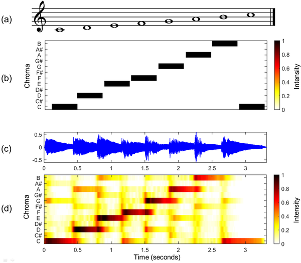
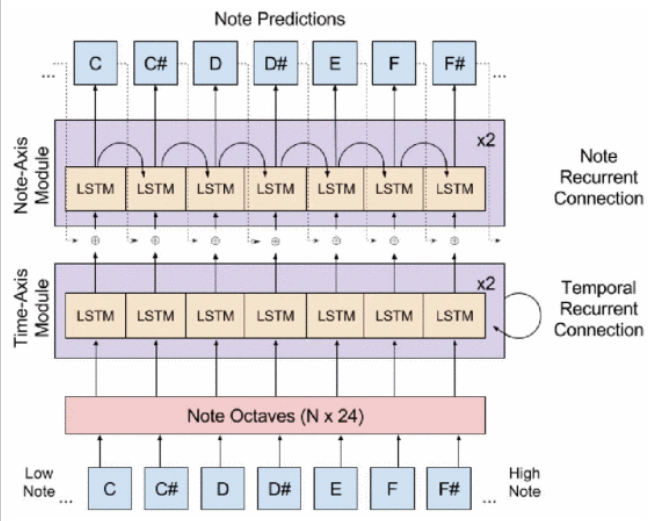
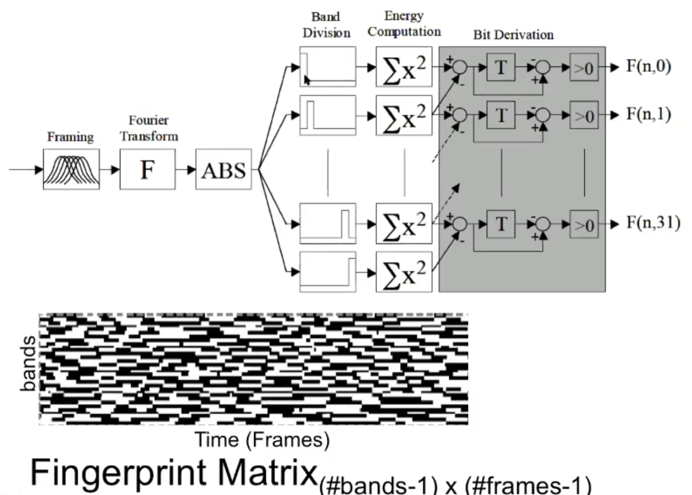
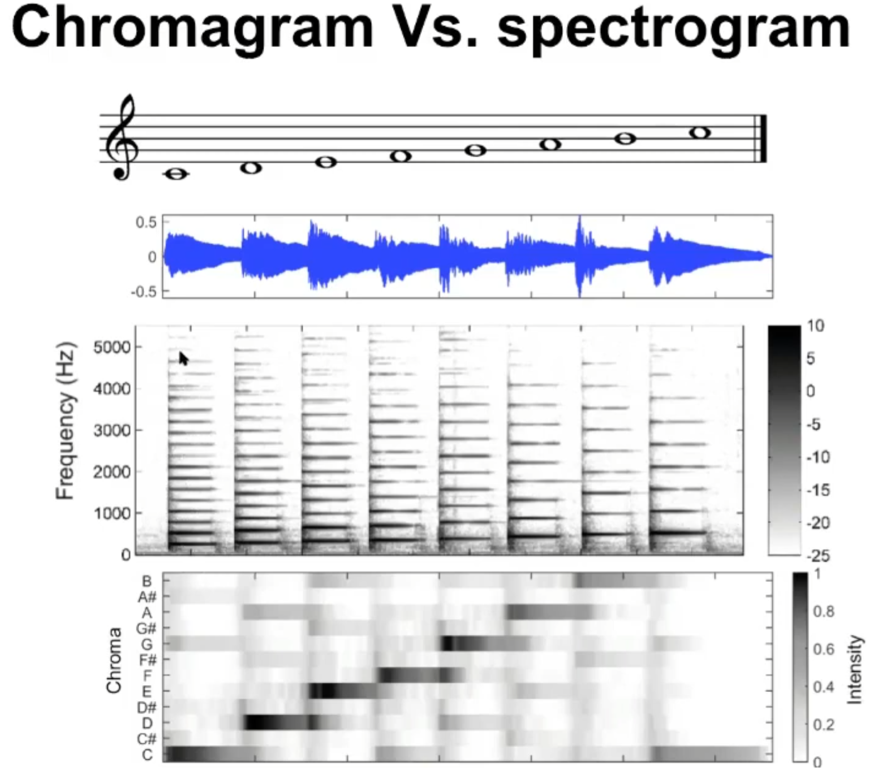

跟音乐相关的ML
应该先看survey 而不是自己做survey???
1. survey 17: Deep Learning Techniques for Music Generation – A Survey 17
https://arxiv.org/pdf/1709.01620
- symbolic AI – dealing with high-level symbolic representations (e.g., chords, harmony. . . ) and processes (harmonization, analysis. . . ); and
- sub-symbolic AI – dealing with low-level representations (e.g., sound, timbre. . . ) and processes (pitch recognition,
classification. . . ).

(a) Musical score of a C-major scale. (b) Chromagram obtained from the score. (c) Audio recording of the C-major scale played on a piano. (d) Chromagram obtained from the audio recording.

4.11.2 One-hot, Many-Hot and to Multi-One-Hot

Dataset:
4.12.2 Datasets and Libraries
- Classical piano MIDI database http://piano-midi.de/

# CONCERT 94
Neural network music composition by prediction: Exploring the benefits of psychoacoustic constraints and multi-scale processing"
- estimating the probability of playing the next note
- generated notes: $P(Y_{n+1}=y_{n+1}|Y_n=y_n, Y_{n−1}=y_{n−1}, Y_{n−2}=y_{n−2},…)$
  
# DeepJ 18
增强改变 Style 和 type
polyphonic music conditioned on a specific or a mixture of multiple composer styles
- polyphonic (复调): not monophonic 

## Method:
- previous: comb of RNN, RBM (restricted Boltzmann machines):
- **Novel**:  Biaxial LSTM

Biaxial LSTM
1. rep: MIDI $N×T$ 
2. architecture:  $P(Y_{t, n}\vert Y_{t, n-1}, \ Y_{t, n-2}, \ \ldots, \ Y_{t-1, N}, \ Y_{t-1, N-1}, \ldots, \ Y_{1, 2}, \ Y_{1, 1})$

# Bach 2.0
https://www.sciencedirect.com/science/article/pii/S1877050919313444?via%3Dihub

# ISMIR
https://ismir.net/conferences/

# Prof Shlomo Dubnov
Google scholar: https://scholar.google.com/citations?view_op=list_works&hl=en&hl=en&user=NJfiIl8AAAAJ&sortby=pubdate
Webpage: http://shlomodubnov.wikidot.com/research

# prof Gus Xia 的讲座
https://www.youtube.com/watch?v=dPeh3XVlmlE
## Intro: pitches tuning: 
pythagorean tuning: 三分损益法， 五度相生律
Octave 2：1 with fifth 3:2
八度 2：1， 五度3：2
十二平均律： $2^{(x/12)}$

## AI+ Music listening 
### Fingerprint 
Extraction Algorithm: Philips (2002)

傅里叶分析什么的
Short-time fourier transform 
FFT size 0.37
Hanning window
### Query by Humming
1. partial matching
2. fuzzy match
3. out of pitch

MIDI + 合成器
MIDI(straigthforward like a string) != Audio (quantization)

Absolute pitch
relatice pitch
IOI(Inter Onset Interval) ratio

Dynamic programming
Pattern recognition:
### Features 
spectrum(energy at diss frequencies), MFCC, Zero crossing, Chroma, Estimtates of tempo
chromagram, spectrogram 

## AI+ Music Composition
Algorithmic composition

Canon, 
### Deterministic
Fractal:分型
### Stochastic process
### ML: Music as sequence
### Mapping natural phenomena ot music 

## AI+ Music Composition

# Fugue
在赋格中，基本元素包括：

主题 (Subject)：赋格开始时由一个声部提出的旋律动机。
答题 (Answer)：另一声部紧接主题以模仿的形式进入，一般会转调至属音。
对题 (Countersubject)：伴随答题出现的第二个旋律动机。
插段 (Episode)：主题和答题出现后，插入的自由发展段落。
codetta
interlude
赋格的陈述部分 (Exposition) 是其最严格的部分，之后的段落则允许更自由的变化。作曲家可以通过各种技术手段如加倍 (augmentation)、减缩 (diminution)、倒影 (inversion) 和紧缩 (stretto) 来改变主题的原型。

# Fourier Transform
https://ltyxh.com/blog/2022/05/17/%E9%9F%B3%E9%A2%91%E6%8A%80%E6%9C%AF4/
这个系列讲的特别清楚

# VAE
从0教你VAE：
    - 交叉熵与KL散度(信息论)：
        - https://zhuanlan.zhihu.com/p/345025351 
            - $I(x) = K log(P(x)), K<0$ Information
            - $H(p) = -\sum p(x_i)logp(x_i)$ Entropy
        - https://zhuanlan.zhihu.com/p/346518942
    - MSE, 0-1 loss, Logistic loss:
        -  https://zhuanlan.zhihu.com/p/346935187
    - VAE：
        - https://zhuanlan.zhihu.com/p/348498294
        - https://zhuanlan.zhihu.com/p/34998569
        - VAE讲解：https://www.zhangzhenhu.com/aigc/%E5%8F%98%E5%88%86%E8%87%AA%E7%BC%96%E7%A0%81%E5%99%A8.html

## Loss Functions
Cross Entropy Loss:
$H(p, q) = \mathbb{E}_{X \sim p(X)} \left[ - \log q(X) \right].\\$

KL Divergence:
对于离散随机变量，分布$p$和$q$的KL散度的定义如下：

$D_{K L}(p \| q) = -\sum_{i=1}^{n} p(x_{i}) \cdot \log \frac{q(x_{i})}{p(x_{i})}.\\$

对KL散度在信息论中的一个直观的理解是将其写开，即

$\begin{aligned} D_{K L}(p \| q) &= -\sum_{i=1}^{n} p(x_{i}) \cdot \log \frac{q(x_{i})}{p(x_{i})} \\                 &= -\sum_{i=1}^{n} p(x_{i}) \cdot \log q(x_{i}) + \sum_{i=1}^{n} p(x_{i}) \cdot \log p(x_{i}) \\                 &= H(p,q) - H(p). \end{aligned}\\$

## 好东西，，
loss详解
https://www.zhihu.com/column/c_1334301979816820736

除了我都会，，图神经网络
https://www.zhihu.com/column/c_1322582255018184704

## VAE
总的来说觉得x和z是对称的，但x可采样，打破对称性。
但是不是的，，

## 讲得很好
DDPM视频：https://www.bilibili.com/video/BV1p24y1K7Pf?spm_id_from=333.788.videopod.sections&vd_source=441679270dda23308fe16f3c5602b058
文章：https://www.bilibili.com/read/cv23338176/?jump_opus=1
知乎版本： https://zhuanlan.zhihu.com/p/624851115

ode和可视化： https://developer.nvidia.com/blog/generative-ai-research-spotlight-demystifying-diffusion-based-models/

# Diffusion model 
介绍了consisitency model, VAE, Diffusion model , stable diffusion, LoRA, Latent Consistency Model 之间的关系，
从头讲解的Consistency model 的原理
https://wrong.wang/blog/20220605-%E4%BB%80%E4%B9%88%E6%98%AFdiffusion%E6%A8%A1%E5%9E%8B/

https://antarina.tech/posts/notes/articles/%E7%AC%94%E8%AE%B0speed_sd.html

https://lilianweng.github.io/posts/2021-07-11-diffusion-models/

# Consisitency Diffusion
https://wrong.wang/blog/20231111-consistency-is-all-you-need/
https://zhuanlan.zhihu.com/p/692998238
https://zhuanlan.zhihu.com/p/706862530
# DIFF-A-RIFF: Musical Acoompanimetn via latent diffusion models
1. Consistency Autoencoder
2. Elucidated Diffusion Models (EDMs)
   
Related: 
1. End-to-End Autoregressive model:
    - high fidelity and ability to produce coherent, long-range sequences
    - expensive cost for calculateion
    - GANs/VAEs are faster but limiting fidelity
    - Denoising Difussion Implicit Models:
2. Latent models
    -  
3. Control Mechanism
   - Music ControlNet
   - 

# Flow matching

# Score matching 
score
$\nabla_x log p_\sigma(x)$

https://www.zhangzhenhu.com/aigc/Guidance.html

看到奇怪的人： https://www.zhihu.com/people/labsig

zou教授发的三篇论文
https://arxiv.org/pdf/2406.08384
 
https://arxiv.org/pdf/2405.18503
 
https://openreview.net/pdf?id=mUVydzrkgz
 

