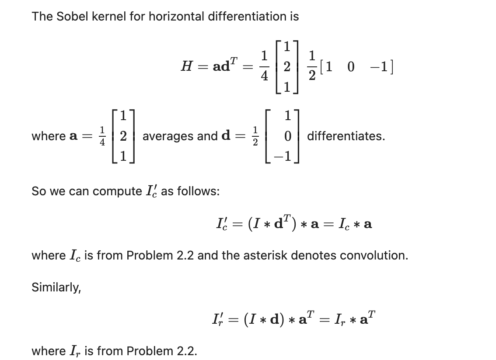
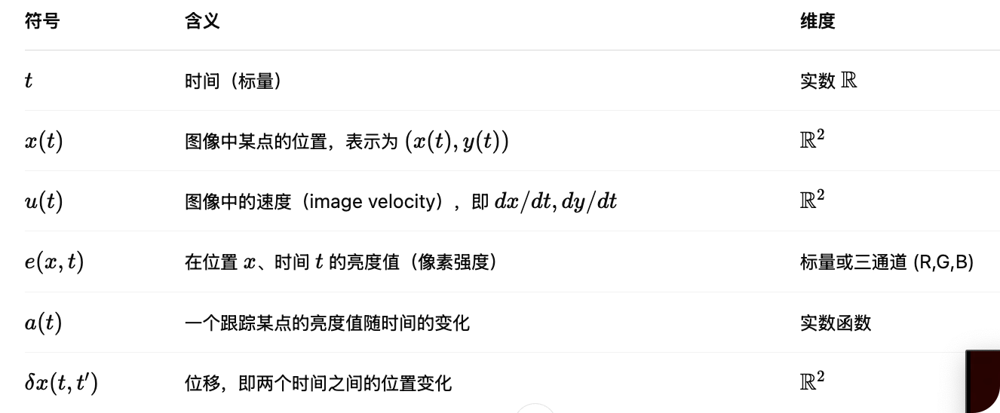
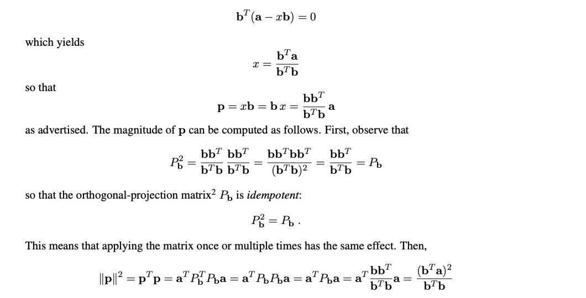

我觉得教授说的很有道理。 First use simple cases as examples, then gradually increase the difficulty.
For example the gradient descent. Use 2 * 2 as example, then others. 

## U-Net 论文阅读
https://github.com/zhixuhao/unet

### Terms
Image segmentation: assign every pixel a label \

### Motivation
Previous method:
- Ciresan et al. : Purely CNN (?)
    - slow: redundancy of patches
    - trade-off between localization accuracy and the use of context

### Propose method: 
Fully CN:
-  pooling op are replaced by upsampling op:  increase the resolution
- 

(excessive) Date Augmentation: elastic deformation
- 

### Results
- Pixel error: compare 2 pic
- Rand Error

## 期末
吗的，没有认真听过一节课。我真恶心。
以下是期末复习计划： 1.先把所有的作业看懂。然后理一下作业里的知识点和公式。不能带cheatsheeet所以玩啦
cv复习技巧
1. 以作业为主。把作业每题都手作一遍。
2. 看讲义。讲义里很多重要的公式（不要看太细，重点看作业里出现的）
3. 考完试把cv的作业都补一遍。

感觉要考quiz的原题。可能要看一遍，不然这门课就完了。
复习微积分，线性代数。

## hw 1
exam style problem:
1, 2, 3.1

### 1. cor/conv
Correlation:
correlation coefficient 
correlation formula at position $i = \sum_{j=0}^{k-1} I[i + j] \cdot H[j]$

convolution:$i = \sum_{j=0}^{k-1} I[i - j] \cdot H[j]$
full/valid/same
大小 valid < same < full

### 2. smoothing
gaussian(u, v) =def= e...
seperability与简便计算

### 2. differentiation
#### def
区分
finite difference: $I_c(r, c) \approx I(r, c + 1) - I(r, c)$
central difference: $I_c(r, c) \approx \frac{I(r, c+1) - I(r, c-1)}{2}$

#### sobel filter
不要忘记系数啊。。。（normalize系数可以保证亮度正常
smoothing $s =\frac{1}{4} \begin{bmatrix} 1, 2, 1 \end{bmatrix}^T$
differentiation: $d =\frac{1}{2} \begin{bmatrix} 1, 0, -1 \end{bmatrix}^T $
$v=s^Td, h=d^Ts$

sepearable
晕

### 3. interpolation(x)
点的权重为对角正方形的面积
bilinear; 
$\delta a = a - \lfloor a \rfloor$, $\delta b = b - \lfloor b \rfloor$
$\begin{aligned}
I(a,b) &= I(\lfloor a \rfloor, \lfloor b \rfloor)(1 - \delta a)(1 - \delta b) \\
&+ I(\lfloor a \rfloor, \lfloor b \rfloor + 1)(1 - \delta a)\delta b \\
&+ I(\lfloor a \rfloor + 1, \lfloor b \rfloor)\delta a(1 - \delta b) \\
&+ I(\lfloor a \rfloor + 1, \lfloor b \rfloor + 1)\delta a\delta b
\end{aligned}$

## hw 2
exam problem:
1.1 - 1.8 ， 3.1， 4.1
给f(x, y)
1.1. 求gradient $\nabla f=$
1.2 stationary point 判定(local max/min/saddle) D= f_xx * f_yy-f_xy^2
1.3 ordinary gradient descent
1.4 gradient descent with momentum
1.5 step of Newton's method
1.6 1. 哪个离真实值更近2. Gauss-Newton method 是否可用
1.7 GD的convergence point
1.8 数值精度是否影响收敛

3.1 SGD 手算
一个数据点？

4.1
SG和batch

concepts
jacobian: 一阶导, hessian: 二阶导
### notation:
risk function(给定f(x)) = loss function(未知fx？)
first-order gradient descent 只是近似
    how to derive step size $\alpha_k$
        fix 
        adam?
        momentum
    how to determine the local min
        line search
    terminaltion check
    SGD
        mini batch average
        epoch 
second-order
    Newton's method
        Hessian
        positive-definite: asymptotically faster convergence
    Newton-Raphson method:
        f shuold be convex

### formula
$\nabla f(x,y)= \begin{bmatrix}\frac{\partial f}{\partial x}\\[6pt]\frac{\partial f}{\partial y}\end{bmatrix}$

$H_f(x,y)=\begin{bmatrix}\frac{\partial^2 f}{\partial x^2} & \frac{\partial^2 f}{\partial x\partial y}\\[6pt]\frac{\partial^2 f}{\partial y\partial x} & \frac{\partial^2 f}{\partial y^2}\end{bmatrix}$

$p_{k+1} = \mu p_k - \alpha_k \nabla f(x_k)$
$x_{k+1} = x_k + p_{k+1}$
$x_k$是位置，$p_k$是momentum，$\alpha_k$是步长，$\nabla f(x_k)$是梯度， 
since starts with zero velocity,$p_0=0$

$\phi_n$ loss, risk = loss function

$f(\mathbf{z})$ risk
$\mathbf{g}_0=\nabla f(\mathbf{z}_0)$ gradient
$H(\mathbf{z}_0)$ curvature of f near z0
$H(\mathbf{z}_0) = \left[ \frac{\partial^2 f}{\partial z_i \partial z_j} \right]_{\mathbf{z} = \mathbf{z}_0}$

Newton Method
$f(\mathbf{z}) \approx f(\mathbf{z}_0) + \nabla f(\mathbf{z}_0)^T (\mathbf{z} - \mathbf{z}_0) + \frac{1}{2} (\mathbf{z} - \mathbf{z}_0)^T H(\mathbf{z}_0) (\mathbf{z} - \mathbf{z}_0)$

$H_0 \Delta \mathbf{z}_0 = -\mathbf{g}_0
\Rightarrow
\Delta \mathbf{z}_0=z-z_0 = - H_0^{-1} \mathbf{g}_0$

Newton-rapthon
$f(\mathbf{z}) = \sum_{n=1}^{N} \phi_n^2(\mathbf{z})$

## hw3
1    2.1-2    3.1
1.1 求矩阵row/null space的unit vector
1.2 x使x^2最小
1.3 求x解集
1.5 bcce 待公式
1.6 Lucas-Kanade tracker

### concept
#### BCCE的前提假设
如果一个点在现实世界中移动，它的亮度在图像中是不会变的
公式表达；$a(t) = e(x(t), t)\Rightarrow \frac{da(t)}{dt} = 0$

$\frac{d}{dt} a(t) = 0
\Rightarrow 
\frac{\partial e}{\partial x^T} \cdot \frac{dx}{dt} + \frac{\partial e}{\partial t} = 0$

u: image velocity
$\delta x$ displacemen
u=$\delta x / \delta t$, $\delta t \to\infty$

$u\nabla e(x)/|\nabla e(x)|$
normal component $\nu =def=n(x)^{\top}u(x)$

#### apreture probelm
BCCE是标量方程， $u = (u_x, u_y)^T$是二维，所以只能知道u的方向...
Motion Field	真实世界中物体运动在图像上的投影（我们想知道的）
Optical Flow	我们从图像中通过亮度变化估计到的速度（我们能观测到的）
$\nu(x) = \mathbf{n}(x)^T u(x)$ 提督方向*
$\nu(x)$ 某个pixel速度沿着这个方向的“可观测分量”。
只能知道u的方向。  
the normal compenet of motion $\nu$

因为们不能只靠一个像素就估计出完整的运动向量，所以用一个整体的方法去估计图像中所有像素的运动向量（光流）Optical flow
1 data term: $E_\text{data} = \sum_{x} \left( \frac{\partial e}{\partial x} \cdot u(x) + \frac{\partial e}{\partial t} \right)^2$满足BCCE function
2 smoothness term: $E_\text{smooth} = \sum_{x} \left( \frac{\partial u_x}{\partial x} + \frac{\partial u_y}{\partial y} \right)^2$
$E = \lambda E_\text{data} + (1 - \lambda) E_\text{smooth}$
可能的缺点Tend to blur the solution near motion boundaries

#### Local support motion estimation (using tracking windows)
x是二维坐标$x \in \mathbb{R}^2$, f(x), g(x)是两幅图像
我们把一个local的小窗口看作一个整体, 从x_f移动到x_g=x_f+d, 对应的图像是f(x_f)和g(x_f+d),枚举周围的x，计算平方loss，权重和距离有关 w(x-x_f)
$W(x_f)$是个集合={pixel in window}
$w(x) = \begin{cases}1 & \text{if } |x_1| \le h \text{ and } |x_2| \le h \\0 & \text{otherwise}\end{cases}$只是定义窗口时2h+1 ^2的小正方形

高斯，只是换种w
$w(x) \propto \begin{cases}e^{- \frac{1}{2} \left( \frac{\|x\|}{\sigma} \right)^2 } & \text{if } |x_1| \le h, |x_2| \le h \\0 & \text{otherwise}\end{cases}$

1. grid search x
2. Lucas-kanade tracker(using Newton-Raphson)
Goal 
    find d that min $L(\mathbf{d}) = \sum_x [g(x + \mathbf{d}) - f(x)]^2 w(x - x_f)$ \
    线性近似$g(x + \mathbf{d}) \approx g(x) + \nabla g(x)^T \mathbf{d}$
    $L(\mathbf{d}) \approx \mathbf{d}^T A \mathbf{d} - 2 \mathbf{b}^T \mathbf{d} + \text{const}$
    L'(d)=0得到$A \mathbf{d} = \mathbf{b}$
    因为是近似的，我们不能一次算出真正的$\mathbf{d}^*$

详细计算(感觉这里写的不对，应该改一下推导过程...)
$L(\mathbf{d}) \approx \sum_x \left[\nabla g(x)^T \mathbf{d} + g(x) - f(x)\right]^2 w(x - x_f)$
$L(\mathbf{d}) = \mathbf{d}^T A \mathbf{d} - 2 \mathbf{b}^T \mathbf{d} + \text{const}$
$A = \sum_x \nabla g(x) \nabla g(x)^T w(x - x_f)$
$\mathbf{b} = \sum_x \nabla g(x) [f(x) - g(x)] w(x - x_f)$
$\nabla g(x) \in \mathbb{R}^2$, $\nabla g(x) \nabla g(x)^T$是2x2的矩阵，$A \in \mathbb{R}^{2 \times 2}$整个窗口中这些小矩阵的加权和, $\mathbf{b} \in \mathbb{R}^2$整个窗口中这些小矩阵{梯度和误差的加权}求和

为什么不解$A \mathbf{d} = \mathbf{b}$， 而是迭代： 因泰勒一阶近似要d很小。但是因为离散，d相对大。
为什么双线性插值？因为Gauss-Newton得到的d*可能小数。
复习一下Gauss-Newton:
    https://chatgpt.com/c/67f2aa07-57a4-8002-a98f-851def653450

头晕，不学了。
large motio用pyramid track
bcce，和motion track的所有问题 https://chatgpt.com/c/67f1a7c8-8c80-8002-a3cc-0b2b4e14f4fe

## hw4
#### 4 Rrigid Geo transf 
忘记的线代：
dot prod/ Proj
$a^Tb=ab\cos\theta$, $a^Tb=0 \iff a\perp b$

$\text{proj}_{\mathbf{a}} \mathbf{v} = \frac{\mathbf{a}^T \mathbf{v}}{\mathbf{a}^T \mathbf{a}} \mathbf{a}$

$P^x=P$ 几何，投影。

cross prod
右手系为正
$\|\mathbf{c}\| = \|\mathbf{a} \times \mathbf{b}\| = \|\mathbf{a}\|\|\mathbf{b}\| \sin\theta$ 平行四边形面积
$[\mathbf{a}]_\times = \begin{bmatrix}
0 & -a_z & a_y \\
a_z & 0 & -a_x \\
-a_y & a_x & 0
\end{bmatrix}$
$\mathbf{a} \times \mathbf{p} = [\mathbf{a}]_\times \mathbf{p}$

triple product
$\mathbf{a} \cdot (\mathbf{b} \times \mathbf{c})$ abc平行六边形体积

coord translation
太有趣了但是看不懂呜呜，里面的数学（应该是矩阵论）是我想学的数学，虽然学数学的不会叫这个数学 https://zhuanlan.zhihu.com/p/508149559

从0->1， 左上角left superscript 是system index, 0 is omitted as world ref sys $S_0$

#### 4 pinhole camera model
pinhole小孔/ optical axis穿过pinhole垂直于成像面的线/ (projection ray)/image plane（成像的面）
trade off between sharp and bright
（把pinhole可以是面积圆，不影响，还会变亮（？
倒像是实像，但是可以等价成对应的虚像。就等价成pinhole camera model 啦
于是pinhole->center of projection,成像面(front screen)对称过去的是image plane,
principal plane 

pixel image coordinate system 左上角为原点 $(\xi, \mu)$
camera reference system P 在center of proj sys坐标中的位置$P=(X, Y, Z)$, Z is called depth
canonical image coordinate system $(x, y), x=X, y=Y$

在写法中$(\xi, \mu)$会表示 image pixel 为单位，$(x, y)$会表示canonical中 sys的坐标，单位mm
例如: 
principal point $\pi_0=(\xi_0, \mu_0)$, scaling factor $s_x, s_y$ pixel per mm
$(\xi , \mu)= (s_x x + \xi_0, s_y y + \mu_0)$
$x/f=X/Z$, $y/Z=Y/Z$

$\boldsymbol{\xi} = K_s \mathbf{p} + \boldsymbol{\pi}_0$
不想看了， 好烦 https://chatgpt.com/c/67f2c6fa-1284-8002-b9a3-7b967317097a

#### epipolar geo
epipolar plane, baseline, image plane, （book是epi plane的旋转轴，比喻成书脊）

已知条件：
不妨以相机a构建坐标系$P_a=(0,0,0)$,朝向为$D_a=\mathbf I_{3\times3}$, $I_a:z=f$, $P=(X, Y, Z)$, camera b 的位置 $^at_b$, 旋转矩阵$^aR_b$

可以求：
可以得到相机b的朝向是$^aR_b D_a = D_b$， 位置是$^at_b$， 
是$I_a$和AP连线的焦点A=(0, 0, 0), $I_b$也是已知的,
方程类是$kRx-f=0$, k=[0, 0, 1], 
BP的方程是，令kR=[u, v, w], 则BP为$L(d)=t+d (kR)^T$, 
ABP方程是$[t]_\times (X, Y, Z)=0$, 
$^ap_a$: 联立 z=f和[X, Y, Z][x, y, z]^T=0, 
$^ap_b$同理已知，$^bp_b=R (^ap_b-t)$

求I_b方程的过程:
$^aI_b$的方程: $z=f$,既  $k^b\vec{x}$+d=0，k=[0, 0, 1]
带入点(0, 0, f)得$d=-f$。 
$^aR_a \ ^a \vec{x}= ^b\vec{x}$， 带入上式得$kR^a \vec{x}+d=0$

但是讲义上不是这么推的, 0个人关心proj center A, B在哪， 其实是有的..., t是相对位置。
给定$a={}^a p_a = \begin{bmatrix} x_a \\ y_a \\ f \end{bmatrix},\quad
b={}^b p_b = \begin{bmatrix} x_b \\ y_b \\ f \end{bmatrix}$, 已知a, b, R, t, e=$^ae_b$是baseline和$I_a$的交点。

根据几何变换有以下成立，
$R^T=\ ^bR_a$, 
因为根据逆变换$ ^aR_b\  ^bR_a^T$,即 $RR^T=I$

$Rt=-^bt_a$, 因为左=右= $^b \vec {AB}$

在sys A中, 
$R^Tb=\ ^ap_b$，因为$^bR_a \ ^bp=\ ^ap-^at_b$,所以令p=camera b， $^bR_a \ ^bp_b=\  ^ap_b-^at_b$ 左边是$R^Tb$， 右边是sys a下的
$a=\ ^ap_a$
令sys的A的原点为$O_A$， 这个式子就是$O_A A\cdot (O_AB\times BA)=0$
$O_AB+BA=O_AA$带入检查得到$R^Tb=a-^at_b$
两边同乘$R$得到$b=R(a-t)$不符合$^bp=R(^ap-t)$ ？？？

epipoplar constrain $b^TEa=0$, where $E=R[t]_\times$

Qestions
思考方式； 这里一共说了几个概念，几个公式，概念之间的逻辑什么，变量的定义和维度是什么

1. GD在>=1数据的时候咋（back prop）更新的啊
2. 好难理解为什么“如果一个点在真实世界中运动，它在图像中的亮度值是不会变的”这个假设会得到$ \frac{d}{dt} e(x(t), t) = 0$
虽然可以解释$e$是亮度，是关于位置向量$x$和时间$t$的函数，但是为什么$e$对$t$求导=0.  $e$的含义是什么...任意一个符合"亮度不变的点"的亮度...?
哪个点?图像中的还是世界里的。图像中的点。其实感觉条件应该说成“任意真实世界的点，在图像中的像亮度不变”。这样好像可以理解。x,t也是图像中的位置和时间。

可能误解的原因是总觉得图像是离散的pixel,现实世界是连续的，所以潜意识里出现了更多的变量，导致感觉条件不完全。
3. 

